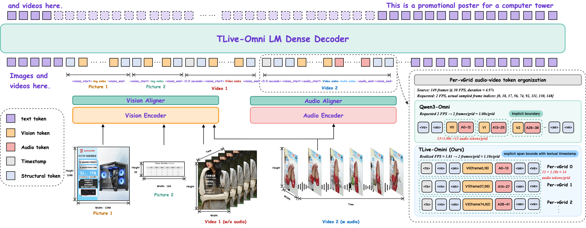
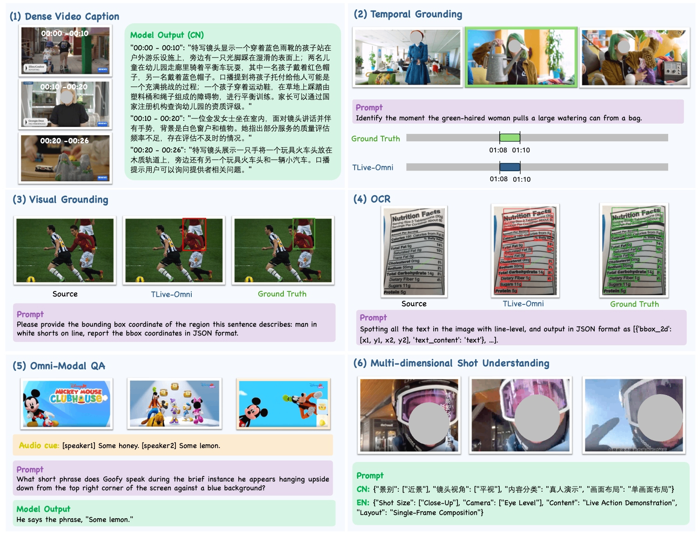

<div align="center">

# 🌟 TLive-Omni 🌟: An Omni-Modal Understanding Model for E-Commerce Live Streaming


</div>

<p align="center">
  <a href="https://github.com/TaoLiveAIGC/TLive-Omni"></a>
  <a href="https://huggingface.co/TaoLiveAIGC/TLive-Omni-4B"></a>
  <a href="https://huggingface.co/TaoLiveAIGC/TLive-Omni-9B"></a>
  <a href="LICENSE"></a>
</p>


## 📰 News

- 🔥 **[2026-08-20]** **Model Release** — TLive-Omni is now available on [Hugging Face](https://huggingface.co/TaoLiveAIGC)! With [TLive-Omni-4B](https://huggingface.co/TaoLiveAIGC/TLive-Omni-4B) and [TLive-Omni-9B](https://huggingface.co/TaoLiveAIGC/TLive-Omni-9B).

## 📋 Overview

TLive-Omni is an omni-modal understanding model for e-commerce live-stream, mapping image, video, audio, and text into a unified text-output interface. Built on a Qwen3.5 backbone with a grafted AuT audio encoder, it supports 256K tokens of context, trained via a three-stage SFT recipe followed by Faithful-RFT reinforcement fine-tuning.

## ✨ Highlights

- **Timestamped Per-vGrid layout** — Audio and video tokens are organized into timestamped grid with explicit boundaries, keeping audio segments adjacent to their corresponding visual content for fine-grained temporal alignment over long streams.
- **Three-stage SFT recipe** — Progressive training from audio-language alignment to full multimodal SFT, developing live-commerce understanding from omni-modal perception to instruction-following responses.
- **Faithful-RFT** — A reinforcement fine-tuning stage for faithful and real-time live-stream demands, suppressing explicit reasoning traces and directly optimizing answer quality for live-commerce tasks.
- **Rich atomic capabilities** — A scenario-oriented taxonomy covering speech recognition, speaker analysis, product visual grounding, text recognition, temporal grounding, video dense caption, and omni-modal QA, etc, supported by a compact data production engine.
- **Strong live-commerce performance with competitive generalization** — 4B and 9B variants demonstrate strong results across live-commerce audio, image, and video tasks, together with excellent generalization on general benchmarks.

## 🏗️ Architecture



TLive-Omni is built on a Qwen3.5 backbone and extends it with a audio encoder through a lightweight MLP aligner, forming a unified text-output omni-modal understanding model. For video inputs with audio, each temporal grid is organized into a timestamped grid that interleaves video and audio token blocks, keeping audio segments adjacent to their corresponding visual content. The model supports up to 256K tokens of context at inference.

## 📊 Benchmark Results

We evaluate TLive-Omni-4B and TLive-Omni-9B on both live-commerce tasks and general benchmarks. Dash (-) denotes an unreported result or undisclosed parameter count. The Best results among open-source models are marked in **bold**, while the second-best results are in <ins>underlined</ins>.

### Live-Commerce Audio Evaluation

<div style="overflow-x:auto">
<small><table>
  <thead>
    <tr>
    <th style="white-space:nowrap;min-width:125px" rowspan="2">Model</th>
    <th style="white-space:nowrap;min-width:62px" rowspan="2">Params</th>
    <th style="white-space:nowrap;min-width:104px" rowspan="2">Live&nbsp;ASR<br>CER&nbsp;↓</th>
    <th style="white-space:nowrap;min-width:118px" rowspan="2">Spk.&nbsp;ASR<br>cpWER&nbsp;↓</th>
    <th colspan="2" style="text-align:center">Audio&nbsp;Description</th>
    <th style="white-space:nowrap;min-width:125px" rowspan="2">Audio&nbsp;QA<br>Acc.&nbsp;↑</th>
    </tr>
    <tr>
    <th style="white-space:nowrap;min-width:188px">Acc.&nbsp;↑</th>
    <th style="white-space:nowrap;min-width:188px">Hal.&nbsp;↓</th>
    </tr>
  </thead>
  <tbody>
    <tr>
      <td colspan="7" style="text-align:center"><b><i>Closed&#8209;source&nbsp;Omni&nbsp;models</i></b></td>
    </tr>
    <tr>
    <td style="white-space:nowrap">Gemini&nbsp;2.5&nbsp;Flash</td>
    <td style="white-space:nowrap">—</td>
    <td style="white-space:nowrap">16.30</td>
    <td style="white-space:nowrap">17.14</td>
    <td style="white-space:nowrap">65.21</td>
    <td style="white-space:nowrap">26.19</td>
    <td style="white-space:nowrap">76.28</td>
    </tr>
    <tr>
    <td style="white-space:nowrap">Gemini&nbsp;2.5&nbsp;Pro</td>
    <td style="white-space:nowrap">—</td>
    <td style="white-space:nowrap">11.48</td>
    <td style="white-space:nowrap">12.17</td>
    <td style="white-space:nowrap">81.10</td>
    <td style="white-space:nowrap">14.16</td>
    <td style="white-space:nowrap">82.85</td>
    </tr>
    <tr>
    <td style="white-space:nowrap">Gemini&nbsp;3&nbsp;Flash</td>
    <td style="white-space:nowrap">—</td>
    <td style="white-space:nowrap">15.18</td>
    <td style="white-space:nowrap">19.04</td>
    <td style="white-space:nowrap">68.27</td>
    <td style="white-space:nowrap">26.17</td>
    <td style="white-space:nowrap">74.68</td>
    </tr>
    <tr>
    <td style="white-space:nowrap">Gemini&nbsp;3&nbsp;Pro</td>
    <td style="white-space:nowrap">—</td>
    <td style="white-space:nowrap">12.09</td>
    <td style="white-space:nowrap">11.67</td>
    <td style="white-space:nowrap">85.07</td>
    <td style="white-space:nowrap">10.92</td>
    <td style="white-space:nowrap">88.62</td>
    </tr>
    <tr>
    <td style="white-space:nowrap">Gemini&nbsp;3.5&nbsp;Flash</td>
    <td style="white-space:nowrap">—</td>
    <td style="white-space:nowrap">13.09</td>
    <td style="white-space:nowrap">11.99</td>
    <td style="white-space:nowrap">79.97</td>
    <td style="white-space:nowrap">14.36</td>
    <td style="white-space:nowrap">87.99</td>
    </tr>
    <tr>
    <td style="white-space:nowrap">Qwen3.5&#8209;Omni&nbsp;Flash</td>
    <td style="white-space:nowrap">—</td>
    <td style="white-space:nowrap">6.81</td>
    <td style="white-space:nowrap">13.23</td>
    <td style="white-space:nowrap">62.82</td>
    <td style="white-space:nowrap">27.81</td>
    <td style="white-space:nowrap">78.04</td>
    </tr>
    <tr>
      <td colspan="7" style="text-align:center"><b><i>Open&#8209;source&nbsp;Audio&nbsp;models</i></b></td>
    </tr>
    <tr>
    <td style="white-space:nowrap">MiMo&#8209;Audio</td>
    <td style="white-space:nowrap">7B</td>
    <td style="white-space:nowrap">12.71</td>
    <td style="white-space:nowrap">—</td>
    <td style="white-space:nowrap">64.26</td>
    <td style="white-space:nowrap">26.01</td>
    <td style="white-space:nowrap">70.97</td>
    </tr>
    <tr>
    <td style="white-space:nowrap">Fun&#8209;Audio&#8209;Chat</td>
    <td style="white-space:nowrap">8B</td>
    <td style="white-space:nowrap">14.55</td>
    <td style="white-space:nowrap">—</td>
    <td style="white-space:nowrap">61.35</td>
    <td style="white-space:nowrap">32.21</td>
    <td style="white-space:nowrap">69.71</td>
    </tr>
    <tr>
    <td style="white-space:nowrap">Step&#8209;Audio&#8209;R1.1</td>
    <td style="white-space:nowrap">32B</td>
    <td style="white-space:nowrap">10.21</td>
    <td style="white-space:nowrap">—</td>
    <td style="white-space:nowrap">75.08</td>
    <td style="white-space:nowrap"><b>20.50</b></td>
    <td style="white-space:nowrap">69.80</td>
    </tr>
    <tr>
      <td colspan="7" style="text-align:center"><b><i>Open&#8209;source&nbsp;Omni&nbsp;models</i></b></td>
    </tr>
    <tr>
    <td style="white-space:nowrap">OmniVinci</td>
    <td style="white-space:nowrap">9B</td>
    <td style="white-space:nowrap">—</td>
    <td style="white-space:nowrap">—</td>
    <td style="white-space:nowrap">39.90</td>
    <td style="white-space:nowrap">47.36</td>
    <td style="white-space:nowrap">66.51</td>
    </tr>
    <tr>
    <td style="white-space:nowrap">Nemotron&nbsp;3&nbsp;Nano&nbsp;Omni</td>
    <td style="white-space:nowrap">30B&#8209;A3B</td>
    <td style="white-space:nowrap">12.10</td>
    <td style="white-space:nowrap">17.65</td>
    <td style="white-space:nowrap">33.01</td>
    <td style="white-space:nowrap">39.77</td>
    <td style="white-space:nowrap">64.90</td>
    </tr>
    <tr>
    <td style="white-space:nowrap">Ming&#8209;Lite&#8209;Omni&nbsp;v1.5</td>
    <td style="white-space:nowrap">20B&#8209;A3B</td>
    <td style="white-space:nowrap">10.06</td>
    <td style="white-space:nowrap">—</td>
    <td style="white-space:nowrap">45.99</td>
    <td style="white-space:nowrap">44.05</td>
    <td style="white-space:nowrap">40.54</td>
    </tr>
    <tr>
    <td style="white-space:nowrap">MiniCPM&#8209;o&nbsp;2.6</td>
    <td style="white-space:nowrap">8B</td>
    <td style="white-space:nowrap">13.88</td>
    <td style="white-space:nowrap">—</td>
    <td style="white-space:nowrap">49.84</td>
    <td style="white-space:nowrap">41.76</td>
    <td style="white-space:nowrap">39.74</td>
    </tr>
    <tr>
    <td style="white-space:nowrap">MiniCPM&#8209;o&nbsp;4.5</td>
    <td style="white-space:nowrap">9B</td>
    <td style="white-space:nowrap">10.70</td>
    <td style="white-space:nowrap">18.89</td>
    <td style="white-space:nowrap">47.59</td>
    <td style="white-space:nowrap">52.41</td>
    <td style="white-space:nowrap">42.47</td>
    </tr>
    <tr>
    <td style="white-space:nowrap">Qwen2.5&#8209;Omni</td>
    <td style="white-space:nowrap">7B</td>
    <td style="white-space:nowrap">7.86</td>
    <td style="white-space:nowrap">—</td>
    <td style="white-space:nowrap">47.92</td>
    <td style="white-space:nowrap">36.92</td>
    <td style="white-space:nowrap">61.38</td>
    </tr>
    <tr>
    <td style="white-space:nowrap">Qwen3&#8209;Omni</td>
    <td style="white-space:nowrap">30B&#8209;A3B</td>
    <td style="white-space:nowrap">6.75</td>
    <td style="white-space:nowrap">27.84</td>
    <td style="white-space:nowrap">61.06</td>
    <td style="white-space:nowrap">30.22</td>
    <td style="white-space:nowrap"><b>76.76</b></td>
    </tr>
    <tr>
      <td colspan="7" style="text-align:center"><b><i>Ours</i></b></td>
    </tr>
    <tr>
    <td style="white-space:nowrap"><b>TLive&#8209;Omni</b></td>
    <td style="white-space:nowrap"><b>4B</b></td>
    <td style="white-space:nowrap"><ins>6.66</ins></td>
    <td style="white-space:nowrap"><ins>12.88</ins></td>
    <td style="white-space:nowrap"><b>76.12</b></td>
    <td style="white-space:nowrap"><ins>20.97</ins></td>
    <td style="white-space:nowrap">72.60</td>
    </tr>
    <tr>
    <td style="white-space:nowrap"><b>TLive&#8209;Omni</b></td>
    <td style="white-space:nowrap"><b>9B</b></td>
    <td style="white-space:nowrap"><b>6.46</b></td>
    <td style="white-space:nowrap"><b>12.27</b></td>
    <td style="white-space:nowrap"><ins>75.96</ins></td>
    <td style="white-space:nowrap">21.00</td>
    <td style="white-space:nowrap"><ins>76.28</ins></td>
    </tr>
  </tbody>
</table></small>
</div>

<small><i>Notes: Live ASR and Spk. ASR denote live-commerce ASR and speaker-attributed ASR.</i></small>


### Live-Commerce Image Evaluation

<div style="overflow-x:auto">
<small><table>
  <thead>
    <tr>
    <th style="white-space:nowrap;min-width:125px" rowspan="2">Model</th>
    <th style="white-space:nowrap;min-width:62px" rowspan="2">Params</th>
    <th colspan="2" style="text-align:center">Visual&nbsp;Grounding</th>
    <th colspan="3" style="text-align:center">Text&nbsp;Understanding</th>
    </tr>
    <tr>
    <th style="white-space:nowrap;min-width:202px">Live&nbsp;AP&nbsp;↑</th>
    <th style="white-space:nowrap;min-width:202px">Prod&nbsp;AP&nbsp;↑</th>
    <th style="white-space:nowrap;min-width:216px">Loc.&nbsp;F1&nbsp;↑</th>
    <th style="white-space:nowrap;min-width:223px">Rec.&nbsp;NED&nbsp;↓</th>
    <th style="white-space:nowrap;min-width:230px">Cls.&nbsp;Acc.&nbsp;↑</th>
    </tr>
  </thead>
  <tbody>
    <tr>
      <td colspan="7" style="text-align:center"><b><i>Closed&#8209;source&nbsp;Omni&nbsp;models</i></b></td>
    </tr>
    <tr>
    <td style="white-space:nowrap">Gemini&nbsp;2.5&nbsp;Flash</td>
    <td style="white-space:nowrap">—</td>
    <td style="white-space:nowrap">61.08</td>
    <td style="white-space:nowrap">28.81</td>
    <td style="white-space:nowrap">20.52</td>
    <td style="white-space:nowrap">43.28</td>
    <td style="white-space:nowrap">51.21</td>
    </tr>
    <tr>
    <td style="white-space:nowrap">Gemini&nbsp;2.5&nbsp;Pro</td>
    <td style="white-space:nowrap">—</td>
    <td style="white-space:nowrap">51.98</td>
    <td style="white-space:nowrap">32.63</td>
    <td style="white-space:nowrap">31.60</td>
    <td style="white-space:nowrap">27.82</td>
    <td style="white-space:nowrap">61.86</td>
    </tr>
    <tr>
    <td style="white-space:nowrap">Gemini&nbsp;3&nbsp;Flash</td>
    <td style="white-space:nowrap">—</td>
    <td style="white-space:nowrap">80.38</td>
    <td style="white-space:nowrap">65.67</td>
    <td style="white-space:nowrap">61.11</td>
    <td style="white-space:nowrap">16.25</td>
    <td style="white-space:nowrap">69.11</td>
    </tr>
    <tr>
    <td style="white-space:nowrap">Gemini&nbsp;3&nbsp;Pro</td>
    <td style="white-space:nowrap">—</td>
    <td style="white-space:nowrap">73.80</td>
    <td style="white-space:nowrap">58.83</td>
    <td style="white-space:nowrap">68.60</td>
    <td style="white-space:nowrap">9.72</td>
    <td style="white-space:nowrap">76.86</td>
    </tr>
    <tr>
    <td style="white-space:nowrap">Gemini&nbsp;3.5&nbsp;Flash</td>
    <td style="white-space:nowrap">—</td>
    <td style="white-space:nowrap">84.15</td>
    <td style="white-space:nowrap">74.89</td>
    <td style="white-space:nowrap">64.44</td>
    <td style="white-space:nowrap">16.64</td>
    <td style="white-space:nowrap">69.76</td>
    </tr>
    <tr>
    <td style="white-space:nowrap">Qwen3.5&#8209;Omni&nbsp;Flash</td>
    <td style="white-space:nowrap">—</td>
    <td style="white-space:nowrap">79.96</td>
    <td style="white-space:nowrap">60.44</td>
    <td style="white-space:nowrap">74.07</td>
    <td style="white-space:nowrap">12.48</td>
    <td style="white-space:nowrap">53.25</td>
    </tr>
    <tr>
      <td colspan="7" style="text-align:center"><b><i>Open&#8209;source&nbsp;Omni&nbsp;models</i></b></td>
    </tr>
    <tr>
    <td style="white-space:nowrap">OmniVinci</td>
    <td style="white-space:nowrap">9B</td>
    <td style="white-space:nowrap">34.86</td>
    <td style="white-space:nowrap">8.93</td>
    <td style="white-space:nowrap">50.25</td>
    <td style="white-space:nowrap">32.77</td>
    <td style="white-space:nowrap">57.29</td>
    </tr>
    <tr>
    <td style="white-space:nowrap">Nemotron&nbsp;3&nbsp;Nano&nbsp;Omni</td>
    <td style="white-space:nowrap">30B&#8209;A3B</td>
    <td style="white-space:nowrap">73.08</td>
    <td style="white-space:nowrap">48.62</td>
    <td style="white-space:nowrap">52.91</td>
    <td style="white-space:nowrap">29.42</td>
    <td style="white-space:nowrap">37.86</td>
    </tr>
    <tr>
    <td style="white-space:nowrap">Ming&#8209;Lite&#8209;Omni&nbsp;v1.5</td>
    <td style="white-space:nowrap">20B&#8209;A3B</td>
    <td style="white-space:nowrap">52.46</td>
    <td style="white-space:nowrap">40.73</td>
    <td style="white-space:nowrap">13.27</td>
    <td style="white-space:nowrap">59.16</td>
    <td style="white-space:nowrap">32.94</td>
    </tr>
    <tr>
    <td style="white-space:nowrap">MiniCPM&#8209;o&nbsp;2.6</td>
    <td style="white-space:nowrap">8B</td>
    <td style="white-space:nowrap">3.82</td>
    <td style="white-space:nowrap">1.77</td>
    <td style="white-space:nowrap">5.74</td>
    <td style="white-space:nowrap">77.58</td>
    <td style="white-space:nowrap">15.92</td>
    </tr>
    <tr>
    <td style="white-space:nowrap">MiniCPM&#8209;o&nbsp;4.5</td>
    <td style="white-space:nowrap">9B</td>
    <td style="white-space:nowrap">23.90</td>
    <td style="white-space:nowrap">53.63</td>
    <td style="white-space:nowrap">5.43</td>
    <td style="white-space:nowrap">71.65</td>
    <td style="white-space:nowrap">11.62</td>
    </tr>
    <tr>
    <td style="white-space:nowrap">Qwen2.5&#8209;Omni</td>
    <td style="white-space:nowrap">7B</td>
    <td style="white-space:nowrap">75.61</td>
    <td style="white-space:nowrap">22.85</td>
    <td style="white-space:nowrap">42.64</td>
    <td style="white-space:nowrap">37.79</td>
    <td style="white-space:nowrap">51.25</td>
    </tr>
    <tr>
    <td style="white-space:nowrap">Qwen3&#8209;Omni</td>
    <td style="white-space:nowrap">30B&#8209;A3B</td>
    <td style="white-space:nowrap">79.22</td>
    <td style="white-space:nowrap">68.88</td>
    <td style="white-space:nowrap">30.46</td>
    <td style="white-space:nowrap">14.83</td>
    <td style="white-space:nowrap">69.46</td>
    </tr>
    <tr>
      <td colspan="7" style="text-align:center"><b><i>Ours</i></b></td>
    </tr>
    <tr>
    <td style="white-space:nowrap"><b>TLive&#8209;Omni</b></td>
    <td style="white-space:nowrap"><b>4B</b></td>
    <td style="white-space:nowrap"><b>82.85</b></td>
    <td style="white-space:nowrap"><b>91.45</b></td>
    <td style="white-space:nowrap"><ins>86.99</ins></td>
    <td style="white-space:nowrap"><ins>4.72</ins></td>
    <td style="white-space:nowrap"><ins>79.06</ins></td>
    </tr>
    <tr>
    <td style="white-space:nowrap"><b>TLive&#8209;Omni</b></td>
    <td style="white-space:nowrap"><b>9B</b></td>
    <td style="white-space:nowrap"><ins>82.33</ins></td>
    <td style="white-space:nowrap"><ins>89.96</ins></td>
    <td style="white-space:nowrap"><b>87.59</b></td>
    <td style="white-space:nowrap"><b>4.24</b></td>
    <td style="white-space:nowrap"><b>79.85</b></td>
    </tr>
  </tbody>
</table></small>
</div>


### Live-Commerce Video Evaluation

<div style="overflow-x:auto">
<small><table>
  <thead>
    <tr>
    <th style="white-space:nowrap;min-width:125px" rowspan="2">Model</th>
    <th style="white-space:nowrap;min-width:62px" rowspan="2">Params</th>
    <th style="white-space:nowrap;min-width:83px" rowspan="2">TG<br>mIoU&nbsp;↑</th>
    <th colspan="2" style="text-align:center">Dense&nbsp;Caption</th>
    <th style="white-space:nowrap;min-width:125px" rowspan="2">Video&nbsp;QA<br>Acc.&nbsp;↑</th>
    <th colspan="4" style="text-align:center">Shot&nbsp;Understanding</th>
    </tr>
    <tr>
    <th style="white-space:nowrap;min-width:160px">Acc.&nbsp;↑</th>
    <th style="white-space:nowrap;min-width:160px">Hal.&nbsp;↓</th>
    <th style="white-space:nowrap;min-width:209px">Layout&nbsp;↑</th>
    <th style="white-space:nowrap;min-width:230px">Shot&nbsp;Size&nbsp;↑</th>
    <th style="white-space:nowrap;min-width:209px">Camera&nbsp;↑</th>
    <th style="white-space:nowrap;min-width:216px">Content&nbsp;↑</th>
    </tr>
  </thead>
  <tbody>
    <tr>
      <td colspan="10" style="text-align:center"><b><i>Closed&#8209;source&nbsp;Omni&nbsp;models</i></b></td>
    </tr>
    <tr>
    <td style="white-space:nowrap">Gemini&nbsp;2.5&nbsp;Flash</td>
    <td style="white-space:nowrap">—</td>
    <td style="white-space:nowrap">76.50</td>
    <td style="white-space:nowrap">54.60</td>
    <td style="white-space:nowrap">10.97</td>
    <td style="white-space:nowrap">88.21</td>
    <td style="white-space:nowrap">80.00</td>
    <td style="white-space:nowrap">46.80</td>
    <td style="white-space:nowrap">84.20</td>
    <td style="white-space:nowrap">68.60</td>
    </tr>
    <tr>
    <td style="white-space:nowrap">Gemini&nbsp;2.5&nbsp;Pro</td>
    <td style="white-space:nowrap">—</td>
    <td style="white-space:nowrap">76.22</td>
    <td style="white-space:nowrap">41.95</td>
    <td style="white-space:nowrap">16.88</td>
    <td style="white-space:nowrap">92.62</td>
    <td style="white-space:nowrap">85.20</td>
    <td style="white-space:nowrap">50.80</td>
    <td style="white-space:nowrap">76.00</td>
    <td style="white-space:nowrap">70.40</td>
    </tr>
    <tr>
    <td style="white-space:nowrap">Gemini&nbsp;3&nbsp;Flash</td>
    <td style="white-space:nowrap">—</td>
    <td style="white-space:nowrap">77.43</td>
    <td style="white-space:nowrap">32.21</td>
    <td style="white-space:nowrap">20.76</td>
    <td style="white-space:nowrap">89.64</td>
    <td style="white-space:nowrap">76.80</td>
    <td style="white-space:nowrap">45.70</td>
    <td style="white-space:nowrap">78.50</td>
    <td style="white-space:nowrap">71.60</td>
    </tr>
    <tr>
    <td style="white-space:nowrap">Gemini&nbsp;3&nbsp;Pro</td>
    <td style="white-space:nowrap">—</td>
    <td style="white-space:nowrap">77.90</td>
    <td style="white-space:nowrap">37.80</td>
    <td style="white-space:nowrap">20.99</td>
    <td style="white-space:nowrap">84.36</td>
    <td style="white-space:nowrap">80.40</td>
    <td style="white-space:nowrap">43.40</td>
    <td style="white-space:nowrap">75.70</td>
    <td style="white-space:nowrap">74.80</td>
    </tr>
    <tr>
    <td style="white-space:nowrap">Gemini&nbsp;3.5&nbsp;Flash</td>
    <td style="white-space:nowrap">—</td>
    <td style="white-space:nowrap">77.90</td>
    <td style="white-space:nowrap">33.80</td>
    <td style="white-space:nowrap">17.30</td>
    <td style="white-space:nowrap">86.90</td>
    <td style="white-space:nowrap">83.40</td>
    <td style="white-space:nowrap">44.20</td>
    <td style="white-space:nowrap">75.50</td>
    <td style="white-space:nowrap">70.20</td>
    </tr>
    <tr>
    <td style="white-space:nowrap">Qwen3.5&#8209;Omni&nbsp;Flash</td>
    <td style="white-space:nowrap">—</td>
    <td style="white-space:nowrap">62.10</td>
    <td style="white-space:nowrap">32.94</td>
    <td style="white-space:nowrap">20.91</td>
    <td style="white-space:nowrap">87.28</td>
    <td style="white-space:nowrap">84.40</td>
    <td style="white-space:nowrap">48.90</td>
    <td style="white-space:nowrap">85.50</td>
    <td style="white-space:nowrap">66.40</td>
    </tr>
    <tr>
      <td colspan="10" style="text-align:center"><b><i>Open&#8209;source&nbsp;Omni&nbsp;models</i></b></td>
    </tr>
    <tr>
    <td style="white-space:nowrap">OmniVinci</td>
    <td style="white-space:nowrap">9B</td>
    <td style="white-space:nowrap">13.10</td>
    <td style="white-space:nowrap">18.59</td>
    <td style="white-space:nowrap">27.13</td>
    <td style="white-space:nowrap">72.51</td>
    <td style="white-space:nowrap">73.60</td>
    <td style="white-space:nowrap"><b>52.70</b></td>
    <td style="white-space:nowrap">68.10</td>
    <td style="white-space:nowrap">49.20</td>
    </tr>
    <tr>
    <td style="white-space:nowrap">Nemotron&nbsp;3&nbsp;Nano&nbsp;Omni</td>
    <td style="white-space:nowrap">30B&#8209;A3B</td>
    <td style="white-space:nowrap">23.39</td>
    <td style="white-space:nowrap">17.96</td>
    <td style="white-space:nowrap">16.62</td>
    <td style="white-space:nowrap">82.56</td>
    <td style="white-space:nowrap"><ins>79.20</ins></td>
    <td style="white-space:nowrap">34.00</td>
    <td style="white-space:nowrap">80.20</td>
    <td style="white-space:nowrap">58.60</td>
    </tr>
    <tr>
    <td style="white-space:nowrap">Ming&#8209;Lite&#8209;Omni&nbsp;v1.5</td>
    <td style="white-space:nowrap">20B&#8209;A3B</td>
    <td style="white-space:nowrap">14.34</td>
    <td style="white-space:nowrap">13.81</td>
    <td style="white-space:nowrap">39.33</td>
    <td style="white-space:nowrap">64.51</td>
    <td style="white-space:nowrap">74.60</td>
    <td style="white-space:nowrap">41.70</td>
    <td style="white-space:nowrap">72.80</td>
    <td style="white-space:nowrap">51.60</td>
    </tr>
    <tr>
    <td style="white-space:nowrap">MiniCPM&#8209;o&nbsp;2.6</td>
    <td style="white-space:nowrap">8B</td>
    <td style="white-space:nowrap">14.56</td>
    <td style="white-space:nowrap">10.53</td>
    <td style="white-space:nowrap">26.93</td>
    <td style="white-space:nowrap">60.30</td>
    <td style="white-space:nowrap">66.60</td>
    <td style="white-space:nowrap">38.30</td>
    <td style="white-space:nowrap">68.30</td>
    <td style="white-space:nowrap">49.00</td>
    </tr>
    <tr>
    <td style="white-space:nowrap">MiniCPM&#8209;o&nbsp;4.5</td>
    <td style="white-space:nowrap">9B</td>
    <td style="white-space:nowrap">43.20</td>
    <td style="white-space:nowrap">21.06</td>
    <td style="white-space:nowrap">28.61</td>
    <td style="white-space:nowrap">84.62</td>
    <td style="white-space:nowrap">78.20</td>
    <td style="white-space:nowrap">42.80</td>
    <td style="white-space:nowrap">79.20</td>
    <td style="white-space:nowrap">66.60</td>
    </tr>
    <tr>
    <td style="white-space:nowrap">Qwen2.5&#8209;Omni</td>
    <td style="white-space:nowrap">7B</td>
    <td style="white-space:nowrap">30.83</td>
    <td style="white-space:nowrap">16.51</td>
    <td style="white-space:nowrap">36.44</td>
    <td style="white-space:nowrap">75.48</td>
    <td style="white-space:nowrap">74.40</td>
    <td style="white-space:nowrap">38.10</td>
    <td style="white-space:nowrap"><ins>81.20</ins></td>
    <td style="white-space:nowrap">68.00</td>
    </tr>
    <tr>
    <td style="white-space:nowrap">Qwen3&#8209;Omni</td>
    <td style="white-space:nowrap">30B&#8209;A3B</td>
    <td style="white-space:nowrap">39.22</td>
    <td style="white-space:nowrap">21.44</td>
    <td style="white-space:nowrap">25.82</td>
    <td style="white-space:nowrap">81.62</td>
    <td style="white-space:nowrap"><b>82.20</b></td>
    <td style="white-space:nowrap">37.40</td>
    <td style="white-space:nowrap">76.10</td>
    <td style="white-space:nowrap">63.60</td>
    </tr>
    <tr>
      <td colspan="10" style="text-align:center"><b><i>Ours</i></b></td>
    </tr>
    <tr>
    <td style="white-space:nowrap"><b>TLive&#8209;Omni</b></td>
    <td style="white-space:nowrap"><b>4B</b></td>
    <td style="white-space:nowrap"><ins>77.63</ins></td>
    <td style="white-space:nowrap"><ins>69.23</ins></td>
    <td style="white-space:nowrap"><ins>9.57</ins></td>
    <td style="white-space:nowrap"><ins>92.31</ins></td>
    <td style="white-space:nowrap">78.40</td>
    <td style="white-space:nowrap"><ins>51.20</ins></td>
    <td style="white-space:nowrap">80.90</td>
    <td style="white-space:nowrap"><ins>69.80</ins></td>
    </tr>
    <tr>
    <td style="white-space:nowrap"><b>TLive&#8209;Omni</b></td>
    <td style="white-space:nowrap"><b>9B</b></td>
    <td style="white-space:nowrap"><b>81.49</b></td>
    <td style="white-space:nowrap"><b>74.63</b></td>
    <td style="white-space:nowrap"><b>8.76</b></td>
    <td style="white-space:nowrap"><b>93.23</b></td>
    <td style="white-space:nowrap">77.00</td>
    <td style="white-space:nowrap">51.00</td>
    <td style="white-space:nowrap"><b>82.00</b></td>
    <td style="white-space:nowrap"><b>71.00</b></td>
    </tr>
  </tbody>
</table></small>
</div>


### General Benchmark: Image Reasoning & QA

<div style="overflow-x:auto">
<small><table>
  <thead>
    <tr>
    <th style="white-space:nowrap;min-width:125px">Model</th>
    <th style="white-space:nowrap;min-width:62px">Params</th>
    <th style="white-space:nowrap;min-width:60px">MMMU</th>
    <th style="white-space:nowrap;min-width:83px">MathVista</th>
    <th style="white-space:nowrap;min-width:76px">DynaMath</th>
    <th style="white-space:nowrap;min-width:60px">VAB</th>
    <th style="white-space:nowrap;min-width:90px">MMBench</th>
    <th style="white-space:nowrap;min-width:62px">RWQA</th>
    <th style="white-space:nowrap;min-width:62px">MMStar</th>
    <th style="white-space:nowrap;min-width:83px">SimpleVQA</th>
    </tr>
  </thead>
  <tbody>
    <tr>
      <td colspan="10" style="text-align:center"><b><i>Closed&#8209;source&nbsp;models</i></b></td>
    </tr>
    <tr>
    <td style="white-space:nowrap">Gemini&nbsp;2.5&nbsp;Flash</td>
    <td style="white-space:nowrap">—</td>
    <td style="white-space:nowrap">76.3</td>
    <td style="white-space:nowrap">75.3</td>
    <td style="white-space:nowrap">69.7</td>
    <td style="white-space:nowrap">75.9</td>
    <td style="white-space:nowrap">86.6</td>
    <td style="white-space:nowrap">75.7</td>
    <td style="white-space:nowrap">75.8</td>
    <td style="white-space:nowrap">59.2</td>
    </tr>
    <tr>
    <td style="white-space:nowrap">Gemini&nbsp;2.5&nbsp;Pro</td>
    <td style="white-space:nowrap">—</td>
    <td style="white-space:nowrap">80.9</td>
    <td style="white-space:nowrap">77.7</td>
    <td style="white-space:nowrap">78.5</td>
    <td style="white-space:nowrap">78.5</td>
    <td style="white-space:nowrap">88.4</td>
    <td style="white-space:nowrap">76.0</td>
    <td style="white-space:nowrap">78.5</td>
    <td style="white-space:nowrap">66.9</td>
    </tr>
    <tr>
    <td style="white-space:nowrap">Gemini&nbsp;3&nbsp;Pro</td>
    <td style="white-space:nowrap">—</td>
    <td style="white-space:nowrap">87.2</td>
    <td style="white-space:nowrap">87.9</td>
    <td style="white-space:nowrap">85.1</td>
    <td style="white-space:nowrap">—</td>
    <td style="white-space:nowrap">93.7</td>
    <td style="white-space:nowrap">83.3</td>
    <td style="white-space:nowrap">83.1</td>
    <td style="white-space:nowrap">73.2</td>
    </tr>
    <tr>
    <td style="white-space:nowrap">GPT&#8209;4o</td>
    <td style="white-space:nowrap">—</td>
    <td style="white-space:nowrap">70.7</td>
    <td style="white-space:nowrap">63.8</td>
    <td style="white-space:nowrap">54.4</td>
    <td style="white-space:nowrap">—</td>
    <td style="white-space:nowrap">86.0</td>
    <td style="white-space:nowrap">—</td>
    <td style="white-space:nowrap">—</td>
    <td style="white-space:nowrap">—</td>
    </tr>
    <tr>
    <td style="white-space:nowrap">GPT&#8209;5&nbsp;(minimal)</td>
    <td style="white-space:nowrap">—</td>
    <td style="white-space:nowrap">74.4</td>
    <td style="white-space:nowrap">50.9</td>
    <td style="white-space:nowrap">74.0</td>
    <td style="white-space:nowrap">53.4</td>
    <td style="white-space:nowrap">81.3</td>
    <td style="white-space:nowrap">77.3</td>
    <td style="white-space:nowrap">65.2</td>
    <td style="white-space:nowrap">56.7</td>
    </tr>
    <tr>
    <td style="white-space:nowrap">Qwen3.5&#8209;Omni&nbsp;Flash</td>
    <td style="white-space:nowrap">—</td>
    <td style="white-space:nowrap">76.9</td>
    <td style="white-space:nowrap">82.9</td>
    <td style="white-space:nowrap">79.3</td>
    <td style="white-space:nowrap">—</td>
    <td style="white-space:nowrap">88.8</td>
    <td style="white-space:nowrap">77.5</td>
    <td style="white-space:nowrap">75.7</td>
    <td style="white-space:nowrap">54.4</td>
    </tr>
    <tr>
      <td colspan="10" style="text-align:center"><b><i>Open&#8209;source&nbsp;VLM&nbsp;models</i></b></td>
    </tr>
    <tr>
    <td style="white-space:nowrap">MiMo&#8209;VL&#8209;SFT</td>
    <td style="white-space:nowrap">7B</td>
    <td style="white-space:nowrap">64.6</td>
    <td style="white-space:nowrap">81.8</td>
    <td style="white-space:nowrap">46.9</td>
    <td style="white-space:nowrap"><b>78.0</b></td>
    <td style="white-space:nowrap">84.5</td>
    <td style="white-space:nowrap">—</td>
    <td style="white-space:nowrap">—</td>
    <td style="white-space:nowrap">—</td>
    </tr>
    <tr>
    <td style="white-space:nowrap">SAIL&#8209;VL2</td>
    <td style="white-space:nowrap">8B</td>
    <td style="white-space:nowrap">55.4</td>
    <td style="white-space:nowrap">76.4</td>
    <td style="white-space:nowrap">17.8</td>
    <td style="white-space:nowrap">—</td>
    <td style="white-space:nowrap">—</td>
    <td style="white-space:nowrap">76.3</td>
    <td style="white-space:nowrap">70.7</td>
    <td style="white-space:nowrap">—</td>
    </tr>
    <tr>
    <td style="white-space:nowrap">Valley2.5</td>
    <td style="white-space:nowrap">8B</td>
    <td style="white-space:nowrap">62.1</td>
    <td style="white-space:nowrap">74.4</td>
    <td style="white-space:nowrap">32.7</td>
    <td style="white-space:nowrap">—</td>
    <td style="white-space:nowrap">85.5</td>
    <td style="white-space:nowrap">70.5</td>
    <td style="white-space:nowrap">67.3</td>
    <td style="white-space:nowrap">—</td>
    </tr>
    <tr>
    <td style="white-space:nowrap">LLaVA&#8209;OneVision&#8209;2</td>
    <td style="white-space:nowrap">8B</td>
    <td style="white-space:nowrap">—</td>
    <td style="white-space:nowrap">—</td>
    <td style="white-space:nowrap">—</td>
    <td style="white-space:nowrap">—</td>
    <td style="white-space:nowrap">85.7</td>
    <td style="white-space:nowrap">69.7</td>
    <td style="white-space:nowrap">64.8</td>
    <td style="white-space:nowrap">—</td>
    </tr>
    <tr>
    <td style="white-space:nowrap">InternVL3.5</td>
    <td style="white-space:nowrap">4B</td>
    <td style="white-space:nowrap">66.6</td>
    <td style="white-space:nowrap">77.1</td>
    <td style="white-space:nowrap">35.7</td>
    <td style="white-space:nowrap">—</td>
    <td style="white-space:nowrap">80.3</td>
    <td style="white-space:nowrap">66.3</td>
    <td style="white-space:nowrap">65.0</td>
    <td style="white-space:nowrap">—</td>
    </tr>
    <tr>
    <td style="white-space:nowrap">InternVL3.5</td>
    <td style="white-space:nowrap">8B</td>
    <td style="white-space:nowrap"><ins>73.4</ins></td>
    <td style="white-space:nowrap">78.4</td>
    <td style="white-space:nowrap">37.7</td>
    <td style="white-space:nowrap">—</td>
    <td style="white-space:nowrap">79.5</td>
    <td style="white-space:nowrap">67.5</td>
    <td style="white-space:nowrap">69.3</td>
    <td style="white-space:nowrap">—</td>
    </tr>
    <tr>
    <td style="white-space:nowrap">Qwen3&#8209;VL</td>
    <td style="white-space:nowrap">4B</td>
    <td style="white-space:nowrap">67.4</td>
    <td style="white-space:nowrap">73.7</td>
    <td style="white-space:nowrap">65.3</td>
    <td style="white-space:nowrap">71.9</td>
    <td style="white-space:nowrap">83.9</td>
    <td style="white-space:nowrap">70.9</td>
    <td style="white-space:nowrap">69.8</td>
    <td style="white-space:nowrap">48.0</td>
    </tr>
    <tr>
    <td style="white-space:nowrap">Qwen3&#8209;VL</td>
    <td style="white-space:nowrap">8B</td>
    <td style="white-space:nowrap">69.6</td>
    <td style="white-space:nowrap">77.2</td>
    <td style="white-space:nowrap">67.7</td>
    <td style="white-space:nowrap">74.0</td>
    <td style="white-space:nowrap">84.5</td>
    <td style="white-space:nowrap">71.5</td>
    <td style="white-space:nowrap">70.9</td>
    <td style="white-space:nowrap"><b>50.2</b></td>
    </tr>
    <tr>
    <td style="white-space:nowrap">Qwen3.5</td>
    <td style="white-space:nowrap">4B</td>
    <td style="white-space:nowrap">72.1</td>
    <td style="white-space:nowrap">81.0</td>
    <td style="white-space:nowrap">69.6</td>
    <td style="white-space:nowrap">62.3</td>
    <td style="white-space:nowrap">86.3</td>
    <td style="white-space:nowrap">72.5</td>
    <td style="white-space:nowrap">74.8</td>
    <td style="white-space:nowrap">44.6</td>
    </tr>
    <tr>
    <td style="white-space:nowrap">Qwen3.5</td>
    <td style="white-space:nowrap">9B</td>
    <td style="white-space:nowrap"><b>74.2</b></td>
    <td style="white-space:nowrap"><b>82.2</b></td>
    <td style="white-space:nowrap"><b>74.6</b></td>
    <td style="white-space:nowrap">71.8</td>
    <td style="white-space:nowrap"><ins>87.7</ins></td>
    <td style="white-space:nowrap">72.9</td>
    <td style="white-space:nowrap"><b>76.3</b></td>
    <td style="white-space:nowrap">48.9</td>
    </tr>
    <tr>
      <td colspan="10" style="text-align:center"><b><i>Open&#8209;source&nbsp;Omni&nbsp;models</i></b></td>
    </tr>
    <tr>
    <td style="white-space:nowrap">InteractiveOmni</td>
    <td style="white-space:nowrap">4B</td>
    <td style="white-space:nowrap">61.1</td>
    <td style="white-space:nowrap">61.7</td>
    <td style="white-space:nowrap">—</td>
    <td style="white-space:nowrap">—</td>
    <td style="white-space:nowrap">78.9</td>
    <td style="white-space:nowrap">—</td>
    <td style="white-space:nowrap">62.6</td>
    <td style="white-space:nowrap">—</td>
    </tr>
    <tr>
    <td style="white-space:nowrap">InteractiveOmni</td>
    <td style="white-space:nowrap">8B</td>
    <td style="white-space:nowrap">66.9</td>
    <td style="white-space:nowrap">68.0</td>
    <td style="white-space:nowrap">—</td>
    <td style="white-space:nowrap">—</td>
    <td style="white-space:nowrap">81.4</td>
    <td style="white-space:nowrap">—</td>
    <td style="white-space:nowrap">66.8</td>
    <td style="white-space:nowrap">—</td>
    </tr>
    <tr>
    <td style="white-space:nowrap">VITA&#8209;1.5</td>
    <td style="white-space:nowrap">7B</td>
    <td style="white-space:nowrap">52.1</td>
    <td style="white-space:nowrap">66.2</td>
    <td style="white-space:nowrap">—</td>
    <td style="white-space:nowrap">—</td>
    <td style="white-space:nowrap">76.7</td>
    <td style="white-space:nowrap">—</td>
    <td style="white-space:nowrap">59.9</td>
    <td style="white-space:nowrap">—</td>
    </tr>
    <tr>
    <td style="white-space:nowrap">Valley3</td>
    <td style="white-space:nowrap">8B</td>
    <td style="white-space:nowrap">69.3</td>
    <td style="white-space:nowrap">—</td>
    <td style="white-space:nowrap">—</td>
    <td style="white-space:nowrap">—</td>
    <td style="white-space:nowrap">—</td>
    <td style="white-space:nowrap">—</td>
    <td style="white-space:nowrap">—</td>
    <td style="white-space:nowrap">—</td>
    </tr>
    <tr>
    <td style="white-space:nowrap">OmniVinci</td>
    <td style="white-space:nowrap">9B</td>
    <td style="white-space:nowrap">49.7</td>
    <td style="white-space:nowrap">63.5</td>
    <td style="white-space:nowrap">—</td>
    <td style="white-space:nowrap">—</td>
    <td style="white-space:nowrap">—</td>
    <td style="white-space:nowrap">67.5</td>
    <td style="white-space:nowrap">—</td>
    <td style="white-space:nowrap">—</td>
    </tr>
    <tr>
    <td style="white-space:nowrap">Nemotron&nbsp;3&nbsp;Nano&nbsp;Omni</td>
    <td style="white-space:nowrap">30B&#8209;A3B</td>
    <td style="white-space:nowrap">55.2</td>
    <td style="white-space:nowrap">71.9</td>
    <td style="white-space:nowrap">—</td>
    <td style="white-space:nowrap">—</td>
    <td style="white-space:nowrap">—</td>
    <td style="white-space:nowrap">—</td>
    <td style="white-space:nowrap">—</td>
    <td style="white-space:nowrap">—</td>
    </tr>
    <tr>
    <td style="white-space:nowrap">Ming&#8209;Lite&#8209;Omni&nbsp;v1.5</td>
    <td style="white-space:nowrap">20B&#8209;A3B</td>
    <td style="white-space:nowrap">54.3</td>
    <td style="white-space:nowrap">72.0</td>
    <td style="white-space:nowrap">—</td>
    <td style="white-space:nowrap">—</td>
    <td style="white-space:nowrap">—</td>
    <td style="white-space:nowrap">—</td>
    <td style="white-space:nowrap">65.1</td>
    <td style="white-space:nowrap">—</td>
    </tr>
    <tr>
    <td style="white-space:nowrap">MiniCPM&#8209;o&nbsp;2.6</td>
    <td style="white-space:nowrap">8B</td>
    <td style="white-space:nowrap">50.4</td>
    <td style="white-space:nowrap">71.9</td>
    <td style="white-space:nowrap">—</td>
    <td style="white-space:nowrap">—</td>
    <td style="white-space:nowrap">80.5</td>
    <td style="white-space:nowrap">—</td>
    <td style="white-space:nowrap">64.0</td>
    <td style="white-space:nowrap">—</td>
    </tr>
    <tr>
    <td style="white-space:nowrap">MiniCPM&#8209;o&nbsp;4.5</td>
    <td style="white-space:nowrap">9B</td>
    <td style="white-space:nowrap">67.6</td>
    <td style="white-space:nowrap">—</td>
    <td style="white-space:nowrap">—</td>
    <td style="white-space:nowrap">—</td>
    <td style="white-space:nowrap">87.6</td>
    <td style="white-space:nowrap">—</td>
    <td style="white-space:nowrap">73.1</td>
    <td style="white-space:nowrap">—</td>
    </tr>
    <tr>
    <td style="white-space:nowrap">Qwen2.5&#8209;Omni</td>
    <td style="white-space:nowrap">7B</td>
    <td style="white-space:nowrap">59.2</td>
    <td style="white-space:nowrap">67.9</td>
    <td style="white-space:nowrap">—</td>
    <td style="white-space:nowrap">—</td>
    <td style="white-space:nowrap">81.8</td>
    <td style="white-space:nowrap">70.3</td>
    <td style="white-space:nowrap">64.0</td>
    <td style="white-space:nowrap">—</td>
    </tr>
    <tr>
    <td style="white-space:nowrap">Qwen3&#8209;Omni</td>
    <td style="white-space:nowrap">30B&#8209;A3B</td>
    <td style="white-space:nowrap">69.1</td>
    <td style="white-space:nowrap">75.9</td>
    <td style="white-space:nowrap">—</td>
    <td style="white-space:nowrap">—</td>
    <td style="white-space:nowrap">—</td>
    <td style="white-space:nowrap">—</td>
    <td style="white-space:nowrap">68.5</td>
    <td style="white-space:nowrap">—</td>
    </tr>
    <tr>
      <td colspan="10" style="text-align:center"><b><i>Ours</i></b></td>
    </tr>
    <tr>
    <td style="white-space:nowrap"><b>TLive&#8209;Omni</b></td>
    <td style="white-space:nowrap"><b>4B</b></td>
    <td style="white-space:nowrap">70.9</td>
    <td style="white-space:nowrap">79.9</td>
    <td style="white-space:nowrap">72.5</td>
    <td style="white-space:nowrap">71.8</td>
    <td style="white-space:nowrap">87.0</td>
    <td style="white-space:nowrap"><b>77.7</b></td>
    <td style="white-space:nowrap">73.9</td>
    <td style="white-space:nowrap">47.6</td>
    </tr>
    <tr>
    <td style="white-space:nowrap"><b>TLive&#8209;Omni</b></td>
    <td style="white-space:nowrap"><b>9B</b></td>
    <td style="white-space:nowrap"><ins>73.4</ins></td>
    <td style="white-space:nowrap"><ins>81.9</ins></td>
    <td style="white-space:nowrap"><ins>73.3</ins></td>
    <td style="white-space:nowrap"><ins>75.5</ins></td>
    <td style="white-space:nowrap"><b>88.9</b></td>
    <td style="white-space:nowrap"><ins>76.6</ins></td>
    <td style="white-space:nowrap"><ins>75.1</ins></td>
    <td style="white-space:nowrap"><ins>50.0</ins></td>
    </tr>
  </tbody>
</table></small>
</div>

<small><i>Notes: MMBench results are reported on the EN-DEV-v1.1 split. VAB and RWQA denote VLMsAreBlind and RealWorldQA.</i></small>


### General Benchmark: Hallucination, OCR, Grounding & Spatial Reasoning

<div style="overflow-x:auto">
<small><table>
  <thead>
    <tr>
    <th style="white-space:nowrap;min-width:125px">Model</th>
    <th style="white-space:nowrap;min-width:62px">Params</th>
    <th style="white-space:nowrap;min-width:83px">Hallusion</th>
    <th style="white-space:nowrap;min-width:60px">AI2D</th>
    <th style="white-space:nowrap;min-width:76px">OCRBench</th>
    <th style="white-space:nowrap;min-width:62px">CC&#8209;OCR</th>
    <th style="white-space:nowrap;min-width:76px">CharXiv</th>
    <th style="white-space:nowrap;min-width:69px">RefCOCO</th>
    <th style="white-space:nowrap;min-width:60px">ERQA</th>
    <th style="white-space:nowrap;min-width:90px">EmbSpatial</th>
    </tr>
  </thead>
  <tbody>
    <tr>
      <td colspan="10" style="text-align:center"><b><i>Closed&#8209;source&nbsp;models</i></b></td>
    </tr>
    <tr>
    <td style="white-space:nowrap">Gemini&nbsp;2.5&nbsp;Flash</td>
    <td style="white-space:nowrap">—</td>
    <td style="white-space:nowrap">59.1</td>
    <td style="white-space:nowrap">87.7</td>
    <td style="white-space:nowrap">86.4</td>
    <td style="white-space:nowrap">74.8</td>
    <td style="white-space:nowrap">60.1</td>
    <td style="white-space:nowrap">—</td>
    <td style="white-space:nowrap">—</td>
    <td style="white-space:nowrap">—</td>
    </tr>
    <tr>
    <td style="white-space:nowrap">Gemini&nbsp;2.5&nbsp;Pro</td>
    <td style="white-space:nowrap">—</td>
    <td style="white-space:nowrap">60.9</td>
    <td style="white-space:nowrap">90.0</td>
    <td style="white-space:nowrap">87.2</td>
    <td style="white-space:nowrap">76.8</td>
    <td style="white-space:nowrap">62.9</td>
    <td style="white-space:nowrap">—</td>
    <td style="white-space:nowrap">50.3</td>
    <td style="white-space:nowrap">73.3</td>
    </tr>
    <tr>
    <td style="white-space:nowrap">Gemini&nbsp;3&nbsp;Pro</td>
    <td style="white-space:nowrap">—</td>
    <td style="white-space:nowrap">68.6</td>
    <td style="white-space:nowrap">94.1</td>
    <td style="white-space:nowrap">90.4</td>
    <td style="white-space:nowrap">79.0</td>
    <td style="white-space:nowrap">81.4</td>
    <td style="white-space:nowrap">84.1</td>
    <td style="white-space:nowrap">70.5</td>
    <td style="white-space:nowrap">61.2</td>
    </tr>
    <tr>
    <td style="white-space:nowrap">GPT&#8209;4o</td>
    <td style="white-space:nowrap">—</td>
    <td style="white-space:nowrap">—</td>
    <td style="white-space:nowrap">82.6</td>
    <td style="white-space:nowrap">84.3</td>
    <td style="white-space:nowrap">—</td>
    <td style="white-space:nowrap">—</td>
    <td style="white-space:nowrap">—</td>
    <td style="white-space:nowrap">—</td>
    <td style="white-space:nowrap">—</td>
    </tr>
    <tr>
    <td style="white-space:nowrap">GPT&#8209;5&nbsp;(minimal)</td>
    <td style="white-space:nowrap">—</td>
    <td style="white-space:nowrap">53.7</td>
    <td style="white-space:nowrap">84.1</td>
    <td style="white-space:nowrap">78.7</td>
    <td style="white-space:nowrap">66.1</td>
    <td style="white-space:nowrap">57.8</td>
    <td style="white-space:nowrap">—</td>
    <td style="white-space:nowrap">42.0</td>
    <td style="white-space:nowrap">75.1</td>
    </tr>
    <tr>
    <td style="white-space:nowrap">Qwen3.5&#8209;Omni&nbsp;Flash</td>
    <td style="white-space:nowrap">—</td>
    <td style="white-space:nowrap">—</td>
    <td style="white-space:nowrap">89.0</td>
    <td style="white-space:nowrap">89.1</td>
    <td style="white-space:nowrap">80.8</td>
    <td style="white-space:nowrap">64.4</td>
    <td style="white-space:nowrap">92.6</td>
    <td style="white-space:nowrap">50.0</td>
    <td style="white-space:nowrap">82.7</td>
    </tr>
    <tr>
      <td colspan="10" style="text-align:center"><b><i>Open&#8209;source&nbsp;VLM&nbsp;models</i></b></td>
    </tr>
    <tr>
    <td style="white-space:nowrap">MiMo&#8209;VL&#8209;SFT</td>
    <td style="white-space:nowrap">7B</td>
    <td style="white-space:nowrap">—</td>
    <td style="white-space:nowrap">83.2</td>
    <td style="white-space:nowrap">87.6</td>
    <td style="white-space:nowrap">—</td>
    <td style="white-space:nowrap">54.4</td>
    <td style="white-space:nowrap">85.7</td>
    <td style="white-space:nowrap">—</td>
    <td style="white-space:nowrap">—</td>
    </tr>
    <tr>
    <td style="white-space:nowrap">SAIL&#8209;VL2</td>
    <td style="white-space:nowrap">8B</td>
    <td style="white-space:nowrap">55.1</td>
    <td style="white-space:nowrap">87.7</td>
    <td style="white-space:nowrap"><b>91.3</b></td>
    <td style="white-space:nowrap">—</td>
    <td style="white-space:nowrap">—</td>
    <td style="white-space:nowrap">74.0</td>
    <td style="white-space:nowrap">—</td>
    <td style="white-space:nowrap">—</td>
    </tr>
    <tr>
    <td style="white-space:nowrap">Valley2.5</td>
    <td style="white-space:nowrap">8B</td>
    <td style="white-space:nowrap">56.3</td>
    <td style="white-space:nowrap">84.4</td>
    <td style="white-space:nowrap">87.0</td>
    <td style="white-space:nowrap">—</td>
    <td style="white-space:nowrap">—</td>
    <td style="white-space:nowrap">—</td>
    <td style="white-space:nowrap">—</td>
    <td style="white-space:nowrap">—</td>
    </tr>
    <tr>
    <td style="white-space:nowrap">LLaVA&#8209;OneVision&#8209;2</td>
    <td style="white-space:nowrap">8B</td>
    <td style="white-space:nowrap">—</td>
    <td style="white-space:nowrap">84.3</td>
    <td style="white-space:nowrap">78.2</td>
    <td style="white-space:nowrap">—</td>
    <td style="white-space:nowrap">—</td>
    <td style="white-space:nowrap">—</td>
    <td style="white-space:nowrap">43.3</td>
    <td style="white-space:nowrap">78.1</td>
    </tr>
    <tr>
    <td style="white-space:nowrap">InternVL3.5</td>
    <td style="white-space:nowrap">4B</td>
    <td style="white-space:nowrap">44.8</td>
    <td style="white-space:nowrap">82.6</td>
    <td style="white-space:nowrap">82.2</td>
    <td style="white-space:nowrap">—</td>
    <td style="white-space:nowrap">39.6</td>
    <td style="white-space:nowrap">89.4</td>
    <td style="white-space:nowrap">38.5</td>
    <td style="white-space:nowrap">—</td>
    </tr>
    <tr>
    <td style="white-space:nowrap">InternVL3.5</td>
    <td style="white-space:nowrap">8B</td>
    <td style="white-space:nowrap">54.5</td>
    <td style="white-space:nowrap">84.0</td>
    <td style="white-space:nowrap">84.0</td>
    <td style="white-space:nowrap">—</td>
    <td style="white-space:nowrap">44.4</td>
    <td style="white-space:nowrap"><ins>89.7</ins></td>
    <td style="white-space:nowrap">41.0</td>
    <td style="white-space:nowrap">73.2</td>
    </tr>
    <tr>
    <td style="white-space:nowrap">Qwen3&#8209;VL</td>
    <td style="white-space:nowrap">4B</td>
    <td style="white-space:nowrap">57.6</td>
    <td style="white-space:nowrap">84.1</td>
    <td style="white-space:nowrap">88.1</td>
    <td style="white-space:nowrap">76.2</td>
    <td style="white-space:nowrap">39.7</td>
    <td style="white-space:nowrap">89.0</td>
    <td style="white-space:nowrap">41.3</td>
    <td style="white-space:nowrap"><ins>79.6</ins></td>
    </tr>
    <tr>
    <td style="white-space:nowrap">Qwen3&#8209;VL</td>
    <td style="white-space:nowrap">8B</td>
    <td style="white-space:nowrap">61.1</td>
    <td style="white-space:nowrap">85.7</td>
    <td style="white-space:nowrap">89.6</td>
    <td style="white-space:nowrap">79.9</td>
    <td style="white-space:nowrap">46.4</td>
    <td style="white-space:nowrap">89.1</td>
    <td style="white-space:nowrap">45.8</td>
    <td style="white-space:nowrap">78.5</td>
    </tr>
    <tr>
    <td style="white-space:nowrap">Qwen3.5</td>
    <td style="white-space:nowrap">4B</td>
    <td style="white-space:nowrap"><ins>76.9</ins></td>
    <td style="white-space:nowrap">87.1</td>
    <td style="white-space:nowrap">85.9</td>
    <td style="white-space:nowrap">71.1</td>
    <td style="white-space:nowrap">62.9</td>
    <td style="white-space:nowrap">87.6</td>
    <td style="white-space:nowrap">46.8</td>
    <td style="white-space:nowrap">76.6</td>
    </tr>
    <tr>
    <td style="white-space:nowrap">Qwen3.5</td>
    <td style="white-space:nowrap">9B</td>
    <td style="white-space:nowrap">76.0</td>
    <td style="white-space:nowrap">88.0</td>
    <td style="white-space:nowrap">88.5</td>
    <td style="white-space:nowrap">73.4</td>
    <td style="white-space:nowrap"><b>67.5</b></td>
    <td style="white-space:nowrap"><b>90.0</b></td>
    <td style="white-space:nowrap"><ins>47.3</ins></td>
    <td style="white-space:nowrap">78.7</td>
    </tr>
    <tr>
      <td colspan="10" style="text-align:center"><b><i>Open&#8209;source&nbsp;Omni&nbsp;models</i></b></td>
    </tr>
    <tr>
    <td style="white-space:nowrap">InteractiveOmni</td>
    <td style="white-space:nowrap">4B</td>
    <td style="white-space:nowrap">52.2</td>
    <td style="white-space:nowrap">83.8</td>
    <td style="white-space:nowrap">80.0</td>
    <td style="white-space:nowrap">—</td>
    <td style="white-space:nowrap">—</td>
    <td style="white-space:nowrap">—</td>
    <td style="white-space:nowrap">—</td>
    <td style="white-space:nowrap">—</td>
    </tr>
    <tr>
    <td style="white-space:nowrap">InteractiveOmni</td>
    <td style="white-space:nowrap">8B</td>
    <td style="white-space:nowrap">61.3</td>
    <td style="white-space:nowrap">84.3</td>
    <td style="white-space:nowrap">83.7</td>
    <td style="white-space:nowrap">—</td>
    <td style="white-space:nowrap">—</td>
    <td style="white-space:nowrap">—</td>
    <td style="white-space:nowrap">—</td>
    <td style="white-space:nowrap">—</td>
    </tr>
    <tr>
    <td style="white-space:nowrap">VITA&#8209;1.5</td>
    <td style="white-space:nowrap">7B</td>
    <td style="white-space:nowrap">44.9</td>
    <td style="white-space:nowrap">79.3</td>
    <td style="white-space:nowrap">73.2</td>
    <td style="white-space:nowrap">—</td>
    <td style="white-space:nowrap">—</td>
    <td style="white-space:nowrap">—</td>
    <td style="white-space:nowrap">—</td>
    <td style="white-space:nowrap">—</td>
    </tr>
    <tr>
    <td style="white-space:nowrap">Valley3</td>
    <td style="white-space:nowrap">8B</td>
    <td style="white-space:nowrap">55.9</td>
    <td style="white-space:nowrap">—</td>
    <td style="white-space:nowrap">—</td>
    <td style="white-space:nowrap">—</td>
    <td style="white-space:nowrap">—</td>
    <td style="white-space:nowrap">—</td>
    <td style="white-space:nowrap">—</td>
    <td style="white-space:nowrap">—</td>
    </tr>
    <tr>
    <td style="white-space:nowrap">Nemotron&nbsp;3&nbsp;Nano&nbsp;Omni</td>
    <td style="white-space:nowrap">30B&#8209;A3B</td>
    <td style="white-space:nowrap">—</td>
    <td style="white-space:nowrap"><ins>88.5</ins></td>
    <td style="white-space:nowrap">88.3</td>
    <td style="white-space:nowrap">—</td>
    <td style="white-space:nowrap">49.1</td>
    <td style="white-space:nowrap">80.6</td>
    <td style="white-space:nowrap">—</td>
    <td style="white-space:nowrap">—</td>
    </tr>
    <tr>
    <td style="white-space:nowrap">Ming&#8209;Lite&#8209;Omni&nbsp;v1.5</td>
    <td style="white-space:nowrap">20B&#8209;A3B</td>
    <td style="white-space:nowrap">54.6</td>
    <td style="white-space:nowrap">84.9</td>
    <td style="white-space:nowrap">88.9</td>
    <td style="white-space:nowrap">—</td>
    <td style="white-space:nowrap">—</td>
    <td style="white-space:nowrap">87.8</td>
    <td style="white-space:nowrap">—</td>
    <td style="white-space:nowrap">—</td>
    </tr>
    <tr>
    <td style="white-space:nowrap">MiniCPM&#8209;o&nbsp;2.6</td>
    <td style="white-space:nowrap">8B</td>
    <td style="white-space:nowrap">51.9</td>
    <td style="white-space:nowrap">85.8</td>
    <td style="white-space:nowrap">89.7</td>
    <td style="white-space:nowrap">—</td>
    <td style="white-space:nowrap">—</td>
    <td style="white-space:nowrap">—</td>
    <td style="white-space:nowrap">—</td>
    <td style="white-space:nowrap">—</td>
    </tr>
    <tr>
    <td style="white-space:nowrap">MiniCPM&#8209;o&nbsp;4.5</td>
    <td style="white-space:nowrap">9B</td>
    <td style="white-space:nowrap">63.2</td>
    <td style="white-space:nowrap">87.6</td>
    <td style="white-space:nowrap">87.6</td>
    <td style="white-space:nowrap">—</td>
    <td style="white-space:nowrap">—</td>
    <td style="white-space:nowrap">—</td>
    <td style="white-space:nowrap">—</td>
    <td style="white-space:nowrap">—</td>
    </tr>
    <tr>
    <td style="white-space:nowrap">Qwen2.5&#8209;Omni</td>
    <td style="white-space:nowrap">7B</td>
    <td style="white-space:nowrap">—</td>
    <td style="white-space:nowrap">83.2</td>
    <td style="white-space:nowrap">—</td>
    <td style="white-space:nowrap">—</td>
    <td style="white-space:nowrap">—</td>
    <td style="white-space:nowrap">87.7</td>
    <td style="white-space:nowrap">—</td>
    <td style="white-space:nowrap">—</td>
    </tr>
    <tr>
    <td style="white-space:nowrap">Qwen3&#8209;Omni</td>
    <td style="white-space:nowrap">30B&#8209;A3B</td>
    <td style="white-space:nowrap">59.7</td>
    <td style="white-space:nowrap">85.2</td>
    <td style="white-space:nowrap">86.0</td>
    <td style="white-space:nowrap">—</td>
    <td style="white-space:nowrap">61.1</td>
    <td style="white-space:nowrap">—</td>
    <td style="white-space:nowrap">—</td>
    <td style="white-space:nowrap">—</td>
    </tr>
    <tr>
      <td colspan="10" style="text-align:center"><b><i>Ours</i></b></td>
    </tr>
    <tr>
    <td style="white-space:nowrap"><b>TLive&#8209;Omni</b></td>
    <td style="white-space:nowrap"><b>4B</b></td>
    <td style="white-space:nowrap"><b>77.7</b></td>
    <td style="white-space:nowrap">86.6</td>
    <td style="white-space:nowrap">86.6</td>
    <td style="white-space:nowrap"><ins>80.5</ins></td>
    <td style="white-space:nowrap">61.3</td>
    <td style="white-space:nowrap">87.4</td>
    <td style="white-space:nowrap">42.3</td>
    <td style="white-space:nowrap">79.3</td>
    </tr>
    <tr>
    <td style="white-space:nowrap"><b>TLive&#8209;Omni</b></td>
    <td style="white-space:nowrap"><b>9B</b></td>
    <td style="white-space:nowrap">76.0</td>
    <td style="white-space:nowrap"><b>88.6</b></td>
    <td style="white-space:nowrap"><ins>90.3</ins></td>
    <td style="white-space:nowrap"><b>81.3</b></td>
    <td style="white-space:nowrap"><ins>63.1</ins></td>
    <td style="white-space:nowrap"><b>90.0</b></td>
    <td style="white-space:nowrap"><b>48.0</b></td>
    <td style="white-space:nowrap"><b>80.4</b></td>
    </tr>
  </tbody>
</table></small>
</div>

<small><i>Notes: CharXiv results are on the RQ split.</i></small>


### General Benchmark: Video Understanding

<div style="overflow-x:auto">
<small><table>
  <thead>
    <tr>
    <th style="white-space:nowrap;min-width:125px">Model</th>
    <th style="white-space:nowrap;min-width:62px">Params</th>
    <th style="white-space:nowrap;min-width:69px">MVBench</th>
    <th style="white-space:nowrap;min-width:60px">MLVU</th>
    <th style="white-space:nowrap;min-width:62px">V&#8209;MME</th>
    <th style="white-space:nowrap;min-width:83px">LongVB</th>
    <th style="white-space:nowrap;min-width:69px">LVBench</th>
    <th style="white-space:nowrap;min-width:60px">MMVU</th>
    <th style="white-space:nowrap;min-width:69px">V&#8209;MMMU</th>
    </tr>
  </thead>
  <tbody>
    <tr>
      <td colspan="9" style="text-align:center"><b><i>Closed&#8209;source&nbsp;models</i></b></td>
    </tr>
    <tr>
    <td style="white-space:nowrap">Gemini&nbsp;2.5&nbsp;Flash</td>
    <td style="white-space:nowrap">—</td>
    <td style="white-space:nowrap">—</td>
    <td style="white-space:nowrap">77.8</td>
    <td style="white-space:nowrap">75.6</td>
    <td style="white-space:nowrap">—</td>
    <td style="white-space:nowrap">62.2</td>
    <td style="white-space:nowrap">68.2</td>
    <td style="white-space:nowrap">65.2</td>
    </tr>
    <tr>
    <td style="white-space:nowrap">Gemini&nbsp;2.5&nbsp;Pro</td>
    <td style="white-space:nowrap">—</td>
    <td style="white-space:nowrap">65.8</td>
    <td style="white-space:nowrap">81.2</td>
    <td style="white-space:nowrap">80.6</td>
    <td style="white-space:nowrap">—</td>
    <td style="white-space:nowrap">69.0</td>
    <td style="white-space:nowrap">72.2</td>
    <td style="white-space:nowrap">79.4</td>
    </tr>
    <tr>
    <td style="white-space:nowrap">Gemini&nbsp;3&nbsp;Pro</td>
    <td style="white-space:nowrap">—</td>
    <td style="white-space:nowrap">74.1</td>
    <td style="white-space:nowrap">83.0</td>
    <td style="white-space:nowrap">87.7</td>
    <td style="white-space:nowrap">76.7</td>
    <td style="white-space:nowrap">76.2</td>
    <td style="white-space:nowrap">77.5</td>
    <td style="white-space:nowrap">87.6</td>
    </tr>
    <tr>
    <td style="white-space:nowrap">GPT&#8209;4o</td>
    <td style="white-space:nowrap">—</td>
    <td style="white-space:nowrap">—</td>
    <td style="white-space:nowrap">—</td>
    <td style="white-space:nowrap">71.9</td>
    <td style="white-space:nowrap">—</td>
    <td style="white-space:nowrap">—</td>
    <td style="white-space:nowrap">—</td>
    <td style="white-space:nowrap">—</td>
    </tr>
    <tr>
    <td style="white-space:nowrap">GPT&#8209;5&nbsp;(minimal)</td>
    <td style="white-space:nowrap">—</td>
    <td style="white-space:nowrap">64.6</td>
    <td style="white-space:nowrap">78.3</td>
    <td style="white-space:nowrap">77.3</td>
    <td style="white-space:nowrap">—</td>
    <td style="white-space:nowrap">—</td>
    <td style="white-space:nowrap">68.1</td>
    <td style="white-space:nowrap">61.6</td>
    </tr>
    <tr>
    <td style="white-space:nowrap">Qwen3.5&#8209;Omni&nbsp;Flash</td>
    <td style="white-space:nowrap">—</td>
    <td style="white-space:nowrap">70.8</td>
    <td style="white-space:nowrap">81.9</td>
    <td style="white-space:nowrap">77.0</td>
    <td style="white-space:nowrap">—</td>
    <td style="white-space:nowrap">—</td>
    <td style="white-space:nowrap">62.7</td>
    <td style="white-space:nowrap">—</td>
    </tr>
    <tr>
      <td colspan="9" style="text-align:center"><b><i>Open&#8209;source&nbsp;VLM&nbsp;models</i></b></td>
    </tr>
    <tr>
    <td style="white-space:nowrap">MiMo&#8209;VL&#8209;SFT</td>
    <td style="white-space:nowrap">7B</td>
    <td style="white-space:nowrap">—</td>
    <td style="white-space:nowrap">—</td>
    <td style="white-space:nowrap">66.9</td>
    <td style="white-space:nowrap">—</td>
    <td style="white-space:nowrap">—</td>
    <td style="white-space:nowrap">—</td>
    <td style="white-space:nowrap">53.1</td>
    </tr>
    <tr>
    <td style="white-space:nowrap">SAIL&#8209;VL2</td>
    <td style="white-space:nowrap">8B</td>
    <td style="white-space:nowrap">—</td>
    <td style="white-space:nowrap">—</td>
    <td style="white-space:nowrap">62.7</td>
    <td style="white-space:nowrap">58.3</td>
    <td style="white-space:nowrap">—</td>
    <td style="white-space:nowrap">—</td>
    <td style="white-space:nowrap">—</td>
    </tr>
    <tr>
    <td style="white-space:nowrap">LLaVA&#8209;OneVision&#8209;2</td>
    <td style="white-space:nowrap">8B</td>
    <td style="white-space:nowrap">66.2</td>
    <td style="white-space:nowrap">76.6</td>
    <td style="white-space:nowrap"><ins>71.9</ins></td>
    <td style="white-space:nowrap">66.9</td>
    <td style="white-space:nowrap">55.5</td>
    <td style="white-space:nowrap">56.2</td>
    <td style="white-space:nowrap">—</td>
    </tr>
    <tr>
    <td style="white-space:nowrap">LLaVA&#8209;Video</td>
    <td style="white-space:nowrap">7B</td>
    <td style="white-space:nowrap">58.6</td>
    <td style="white-space:nowrap">70.8</td>
    <td style="white-space:nowrap">63.3</td>
    <td style="white-space:nowrap">58.2</td>
    <td style="white-space:nowrap">44.2</td>
    <td style="white-space:nowrap">47.1</td>
    <td style="white-space:nowrap">36.1</td>
    </tr>
    <tr>
    <td style="white-space:nowrap">InternVL3.5</td>
    <td style="white-space:nowrap">4B</td>
    <td style="white-space:nowrap">71.2</td>
    <td style="white-space:nowrap">70.4</td>
    <td style="white-space:nowrap">65.4</td>
    <td style="white-space:nowrap">60.8</td>
    <td style="white-space:nowrap">43.2</td>
    <td style="white-space:nowrap">47.6</td>
    <td style="white-space:nowrap">57.6</td>
    </tr>
    <tr>
    <td style="white-space:nowrap">InternVL3.5</td>
    <td style="white-space:nowrap">8B</td>
    <td style="white-space:nowrap">72.1</td>
    <td style="white-space:nowrap">70.2</td>
    <td style="white-space:nowrap">66.0</td>
    <td style="white-space:nowrap">62.1</td>
    <td style="white-space:nowrap">46.7</td>
    <td style="white-space:nowrap">60.2</td>
    <td style="white-space:nowrap">—</td>
    </tr>
    <tr>
    <td style="white-space:nowrap">MiniCPM&#8209;V&nbsp;4.5</td>
    <td style="white-space:nowrap">8B</td>
    <td style="white-space:nowrap">—</td>
    <td style="white-space:nowrap">75.1</td>
    <td style="white-space:nowrap">67.9</td>
    <td style="white-space:nowrap">63.9</td>
    <td style="white-space:nowrap">50.4</td>
    <td style="white-space:nowrap">58.9</td>
    <td style="white-space:nowrap">57.1</td>
    </tr>
    <tr>
    <td style="white-space:nowrap">LongVU</td>
    <td style="white-space:nowrap">7B</td>
    <td style="white-space:nowrap">66.9</td>
    <td style="white-space:nowrap">65.4</td>
    <td style="white-space:nowrap">60.6</td>
    <td style="white-space:nowrap">—</td>
    <td style="white-space:nowrap">—</td>
    <td style="white-space:nowrap">—</td>
    <td style="white-space:nowrap">—</td>
    </tr>
    <tr>
    <td style="white-space:nowrap">LongVILA</td>
    <td style="white-space:nowrap">7B</td>
    <td style="white-space:nowrap">67.1</td>
    <td style="white-space:nowrap">—</td>
    <td style="white-space:nowrap">60.1</td>
    <td style="white-space:nowrap">57.1</td>
    <td style="white-space:nowrap">—</td>
    <td style="white-space:nowrap">—</td>
    <td style="white-space:nowrap">—</td>
    </tr>
    <tr>
    <td style="white-space:nowrap">Mage&#8209;VL</td>
    <td style="white-space:nowrap">4B</td>
    <td style="white-space:nowrap">65.1</td>
    <td style="white-space:nowrap">68.7</td>
    <td style="white-space:nowrap">64.0</td>
    <td style="white-space:nowrap">61.3</td>
    <td style="white-space:nowrap">41.8</td>
    <td style="white-space:nowrap">—</td>
    <td style="white-space:nowrap">—</td>
    </tr>
    <tr>
    <td style="white-space:nowrap">Molmo2</td>
    <td style="white-space:nowrap">4B</td>
    <td style="white-space:nowrap">75.1</td>
    <td style="white-space:nowrap">63.0</td>
    <td style="white-space:nowrap">69.6</td>
    <td style="white-space:nowrap"><ins>68.0</ins></td>
    <td style="white-space:nowrap">53.9</td>
    <td style="white-space:nowrap">51.2</td>
    <td style="white-space:nowrap">50.7</td>
    </tr>
    <tr>
    <td style="white-space:nowrap">Molmo2</td>
    <td style="white-space:nowrap">8B</td>
    <td style="white-space:nowrap"><b>75.9</b></td>
    <td style="white-space:nowrap">60.2</td>
    <td style="white-space:nowrap">69.9</td>
    <td style="white-space:nowrap">67.5</td>
    <td style="white-space:nowrap">52.8</td>
    <td style="white-space:nowrap">—</td>
    <td style="white-space:nowrap">—</td>
    </tr>
    <tr>
    <td style="white-space:nowrap">NVILA</td>
    <td style="white-space:nowrap">8B</td>
    <td style="white-space:nowrap">68.1</td>
    <td style="white-space:nowrap">70.1</td>
    <td style="white-space:nowrap">64.2</td>
    <td style="white-space:nowrap">57.7</td>
    <td style="white-space:nowrap">—</td>
    <td style="white-space:nowrap">—</td>
    <td style="white-space:nowrap">—</td>
    </tr>
    <tr>
    <td style="white-space:nowrap">Kangaroo</td>
    <td style="white-space:nowrap">8B</td>
    <td style="white-space:nowrap">61.1</td>
    <td style="white-space:nowrap">61.0</td>
    <td style="white-space:nowrap">56.0</td>
    <td style="white-space:nowrap">54.8</td>
    <td style="white-space:nowrap">39.4</td>
    <td style="white-space:nowrap">—</td>
    <td style="white-space:nowrap">—</td>
    </tr>
    <tr>
    <td style="white-space:nowrap">Video&#8209;XL2</td>
    <td style="white-space:nowrap">8B</td>
    <td style="white-space:nowrap">—</td>
    <td style="white-space:nowrap">74.8</td>
    <td style="white-space:nowrap">66.6</td>
    <td style="white-space:nowrap">61.0</td>
    <td style="white-space:nowrap">48.4</td>
    <td style="white-space:nowrap">50.0</td>
    <td style="white-space:nowrap">39.9</td>
    </tr>
    <tr>
    <td style="white-space:nowrap">VideoChat3</td>
    <td style="white-space:nowrap">4B</td>
    <td style="white-space:nowrap">—</td>
    <td style="white-space:nowrap">—</td>
    <td style="white-space:nowrap">70.1</td>
    <td style="white-space:nowrap">—</td>
    <td style="white-space:nowrap">56.7</td>
    <td style="white-space:nowrap">56.4</td>
    <td style="white-space:nowrap">57.4</td>
    </tr>
    <tr>
    <td style="white-space:nowrap">VideoLLaMA&nbsp;3</td>
    <td style="white-space:nowrap">7B</td>
    <td style="white-space:nowrap">69.7</td>
    <td style="white-space:nowrap">73.0</td>
    <td style="white-space:nowrap">66.2</td>
    <td style="white-space:nowrap">59.8</td>
    <td style="white-space:nowrap">45.3</td>
    <td style="white-space:nowrap">44.1</td>
    <td style="white-space:nowrap">34.6</td>
    </tr>
    <tr>
    <td style="white-space:nowrap">Qwen3&#8209;VL</td>
    <td style="white-space:nowrap">4B</td>
    <td style="white-space:nowrap">68.9</td>
    <td style="white-space:nowrap">75.3</td>
    <td style="white-space:nowrap">69.3</td>
    <td style="white-space:nowrap">—</td>
    <td style="white-space:nowrap">56.2</td>
    <td style="white-space:nowrap">50.5</td>
    <td style="white-space:nowrap">56.2</td>
    </tr>
    <tr>
    <td style="white-space:nowrap">Qwen3&#8209;VL</td>
    <td style="white-space:nowrap">8B</td>
    <td style="white-space:nowrap">68.7</td>
    <td style="white-space:nowrap">78.1</td>
    <td style="white-space:nowrap">71.4</td>
    <td style="white-space:nowrap">—</td>
    <td style="white-space:nowrap">58.0</td>
    <td style="white-space:nowrap">58.7</td>
    <td style="white-space:nowrap">65.3</td>
    </tr>
    <tr>
    <td style="white-space:nowrap">Qwen3.5</td>
    <td style="white-space:nowrap">4B</td>
    <td style="white-space:nowrap">66.6</td>
    <td style="white-space:nowrap">75.1</td>
    <td style="white-space:nowrap">71.6</td>
    <td style="white-space:nowrap">65.1</td>
    <td style="white-space:nowrap">55.3</td>
    <td style="white-space:nowrap">57.8</td>
    <td style="white-space:nowrap">69.8</td>
    </tr>
    <tr>
    <td style="white-space:nowrap">Qwen3.5</td>
    <td style="white-space:nowrap">9B</td>
    <td style="white-space:nowrap"><ins>75.7</ins></td>
    <td style="white-space:nowrap"><ins>79.7</ins></td>
    <td style="white-space:nowrap">66.9</td>
    <td style="white-space:nowrap">67.9</td>
    <td style="white-space:nowrap"><b>60.9</b></td>
    <td style="white-space:nowrap"><ins>63.7</ins></td>
    <td style="white-space:nowrap">70.3</td>
    </tr>
    <tr>
      <td colspan="9" style="text-align:center"><b><i>Open&#8209;source&nbsp;Omni&nbsp;models</i></b></td>
    </tr>
    <tr>
    <td style="white-space:nowrap">InteractiveOmni</td>
    <td style="white-space:nowrap">4B</td>
    <td style="white-space:nowrap">—</td>
    <td style="white-space:nowrap">68.0</td>
    <td style="white-space:nowrap">63.3</td>
    <td style="white-space:nowrap">57.0</td>
    <td style="white-space:nowrap">—</td>
    <td style="white-space:nowrap">—</td>
    <td style="white-space:nowrap">—</td>
    </tr>
    <tr>
    <td style="white-space:nowrap">InteractiveOmni</td>
    <td style="white-space:nowrap">8B</td>
    <td style="white-space:nowrap">—</td>
    <td style="white-space:nowrap">71.6</td>
    <td style="white-space:nowrap">66.0</td>
    <td style="white-space:nowrap">59.1</td>
    <td style="white-space:nowrap">—</td>
    <td style="white-space:nowrap">—</td>
    <td style="white-space:nowrap">—</td>
    </tr>
    <tr>
    <td style="white-space:nowrap">VITA&#8209;1.5</td>
    <td style="white-space:nowrap">7B</td>
    <td style="white-space:nowrap">55.4</td>
    <td style="white-space:nowrap">—</td>
    <td style="white-space:nowrap">56.1</td>
    <td style="white-space:nowrap">—</td>
    <td style="white-space:nowrap">—</td>
    <td style="white-space:nowrap">—</td>
    <td style="white-space:nowrap">—</td>
    </tr>
    <tr>
    <td style="white-space:nowrap">Valley3</td>
    <td style="white-space:nowrap">8B</td>
    <td style="white-space:nowrap">—</td>
    <td style="white-space:nowrap">55.6</td>
    <td style="white-space:nowrap">—</td>
    <td style="white-space:nowrap">—</td>
    <td style="white-space:nowrap">—</td>
    <td style="white-space:nowrap">—</td>
    <td style="white-space:nowrap">61.2</td>
    </tr>
    <tr>
    <td style="white-space:nowrap">OmniVinci</td>
    <td style="white-space:nowrap">9B</td>
    <td style="white-space:nowrap">70.6</td>
    <td style="white-space:nowrap">—</td>
    <td style="white-space:nowrap">68.2</td>
    <td style="white-space:nowrap">61.3</td>
    <td style="white-space:nowrap">—</td>
    <td style="white-space:nowrap">—</td>
    <td style="white-space:nowrap">—</td>
    </tr>
    <tr>
    <td style="white-space:nowrap">Nemotron&nbsp;3&nbsp;Nano&nbsp;Omni</td>
    <td style="white-space:nowrap">30B&#8209;A3B</td>
    <td style="white-space:nowrap">—</td>
    <td style="white-space:nowrap">—</td>
    <td style="white-space:nowrap">70.8</td>
    <td style="white-space:nowrap">—</td>
    <td style="white-space:nowrap">—</td>
    <td style="white-space:nowrap">—</td>
    <td style="white-space:nowrap">—</td>
    </tr>
    <tr>
    <td style="white-space:nowrap">Ming&#8209;Lite&#8209;Omni&nbsp;v1.5</td>
    <td style="white-space:nowrap">20B&#8209;A3B</td>
    <td style="white-space:nowrap">69.4</td>
    <td style="white-space:nowrap">—</td>
    <td style="white-space:nowrap">67.1</td>
    <td style="white-space:nowrap">59.5</td>
    <td style="white-space:nowrap">—</td>
    <td style="white-space:nowrap">—</td>
    <td style="white-space:nowrap">—</td>
    </tr>
    <tr>
    <td style="white-space:nowrap">MiniCPM&#8209;o&nbsp;2.6</td>
    <td style="white-space:nowrap">8B</td>
    <td style="white-space:nowrap">—</td>
    <td style="white-space:nowrap">—</td>
    <td style="white-space:nowrap">63.9</td>
    <td style="white-space:nowrap">—</td>
    <td style="white-space:nowrap">—</td>
    <td style="white-space:nowrap">—</td>
    <td style="white-space:nowrap">—</td>
    </tr>
    <tr>
    <td style="white-space:nowrap">MiniCPM&#8209;o&nbsp;4.5</td>
    <td style="white-space:nowrap">9B</td>
    <td style="white-space:nowrap">—</td>
    <td style="white-space:nowrap">76.5</td>
    <td style="white-space:nowrap">70.4</td>
    <td style="white-space:nowrap">66.0</td>
    <td style="white-space:nowrap">—</td>
    <td style="white-space:nowrap">—</td>
    <td style="white-space:nowrap">—</td>
    </tr>
    <tr>
    <td style="white-space:nowrap">Qwen2.5&#8209;Omni</td>
    <td style="white-space:nowrap">7B</td>
    <td style="white-space:nowrap">70.3</td>
    <td style="white-space:nowrap">—</td>
    <td style="white-space:nowrap">64.3</td>
    <td style="white-space:nowrap">—</td>
    <td style="white-space:nowrap">—</td>
    <td style="white-space:nowrap">—</td>
    <td style="white-space:nowrap">—</td>
    </tr>
    <tr>
    <td style="white-space:nowrap">Qwen3&#8209;Omni</td>
    <td style="white-space:nowrap">30B&#8209;A3B</td>
    <td style="white-space:nowrap">—</td>
    <td style="white-space:nowrap">75.2</td>
    <td style="white-space:nowrap">70.5</td>
    <td style="white-space:nowrap">—</td>
    <td style="white-space:nowrap">—</td>
    <td style="white-space:nowrap">—</td>
    <td style="white-space:nowrap">—</td>
    </tr>
    <tr>
      <td colspan="9" style="text-align:center"><b><i>Ours</i></b></td>
    </tr>
    <tr>
    <td style="white-space:nowrap"><b>TLive&#8209;Omni</b></td>
    <td style="white-space:nowrap"><b>4B</b></td>
    <td style="white-space:nowrap">69.0</td>
    <td style="white-space:nowrap">76.1</td>
    <td style="white-space:nowrap">71.3</td>
    <td style="white-space:nowrap">66.1</td>
    <td style="white-space:nowrap">57.1</td>
    <td style="white-space:nowrap">59.9</td>
    <td style="white-space:nowrap"><b>73.9</b></td>
    </tr>
    <tr>
    <td style="white-space:nowrap"><b>TLive&#8209;Omni</b></td>
    <td style="white-space:nowrap"><b>9B</b></td>
    <td style="white-space:nowrap">72.5</td>
    <td style="white-space:nowrap"><b>80.9</b></td>
    <td style="white-space:nowrap"><b>75.6</b></td>
    <td style="white-space:nowrap"><b>69.9</b></td>
    <td style="white-space:nowrap"><ins>60.8</ins></td>
    <td style="white-space:nowrap"><b>67.1</b></td>
    <td style="white-space:nowrap"><ins>72.8</ins></td>
    </tr>
  </tbody>
</table></small>
</div>

<small><i>Notes: LongVB denotes LongVideoBench. V-MME and V-MMMU denote Video-MME and VideoMMMU.</i></small>


### General Benchmark: Video Temporal Grounding (TimeLens-Bench)

<div style="overflow-x:auto">
<small><table>
  <thead>
    <tr>
    <th style="white-space:nowrap;min-width:125px">Model</th>
    <th style="white-space:nowrap;min-width:62px">Params</th>
    <th style="white-space:nowrap;min-width:97px">Charades&#8209;TL</th>
    <th style="white-space:nowrap;min-width:118px">ActivityNet&#8209;TL</th>
    <th style="white-space:nowrap;min-width:125px">QVHighlights&#8209;TL</th>
    </tr>
  </thead>
  <tbody>
    <tr>
      <td colspan="5" style="text-align:center"><b><i>Closed&#8209;source&nbsp;models</i></b></td>
    </tr>
    <tr>
    <td style="white-space:nowrap">Gemini&nbsp;2.5&nbsp;Flash</td>
    <td style="white-space:nowrap">—</td>
    <td style="white-space:nowrap">48.6</td>
    <td style="white-space:nowrap">52.5</td>
    <td style="white-space:nowrap">64.3</td>
    </tr>
    <tr>
    <td style="white-space:nowrap">Gemini&nbsp;2.5&nbsp;Pro</td>
    <td style="white-space:nowrap">—</td>
    <td style="white-space:nowrap">52.8</td>
    <td style="white-space:nowrap">58.1</td>
    <td style="white-space:nowrap">70.4</td>
    </tr>
    <tr>
    <td style="white-space:nowrap">GPT&#8209;4o</td>
    <td style="white-space:nowrap">—</td>
    <td style="white-space:nowrap">41.8</td>
    <td style="white-space:nowrap">40.4</td>
    <td style="white-space:nowrap">52.1</td>
    </tr>
    <tr>
    <td style="white-space:nowrap">GPT&#8209;5&nbsp;(minimal)</td>
    <td style="white-space:nowrap">—</td>
    <td style="white-space:nowrap">40.5</td>
    <td style="white-space:nowrap">42.9</td>
    <td style="white-space:nowrap">56.8</td>
    </tr>
    <tr>
      <td colspan="5" style="text-align:center"><b><i>Open&#8209;source&nbsp;VLM&nbsp;models</i></b></td>
    </tr>
    <tr>
    <td style="white-space:nowrap">MiMo&#8209;VL&#8209;SFT</td>
    <td style="white-space:nowrap">7B</td>
    <td style="white-space:nowrap">39.6</td>
    <td style="white-space:nowrap">35.5</td>
    <td style="white-space:nowrap">41.5</td>
    </tr>
    <tr>
    <td style="white-space:nowrap">LLaVA&#8209;OneVision&#8209;2</td>
    <td style="white-space:nowrap">8B</td>
    <td style="white-space:nowrap">53.5</td>
    <td style="white-space:nowrap">53.8</td>
    <td style="white-space:nowrap">66.4</td>
    </tr>
    <tr>
    <td style="white-space:nowrap">LLaVA&#8209;Video</td>
    <td style="white-space:nowrap">7B</td>
    <td style="white-space:nowrap">15.2</td>
    <td style="white-space:nowrap">14.6</td>
    <td style="white-space:nowrap">10.4</td>
    </tr>
    <tr>
    <td style="white-space:nowrap">InternVL3.5</td>
    <td style="white-space:nowrap">4B</td>
    <td style="white-space:nowrap">16.0</td>
    <td style="white-space:nowrap">14.9</td>
    <td style="white-space:nowrap">17.7</td>
    </tr>
    <tr>
    <td style="white-space:nowrap">InternVL3.5</td>
    <td style="white-space:nowrap">8B</td>
    <td style="white-space:nowrap">27.8</td>
    <td style="white-space:nowrap">31.3</td>
    <td style="white-space:nowrap">31.3</td>
    </tr>
    <tr>
    <td style="white-space:nowrap">MiniCPM&#8209;V&nbsp;4.5</td>
    <td style="white-space:nowrap">8B</td>
    <td style="white-space:nowrap">31.9</td>
    <td style="white-space:nowrap">32.3</td>
    <td style="white-space:nowrap">46.1</td>
    </tr>
    <tr>
    <td style="white-space:nowrap">Mage&#8209;VL</td>
    <td style="white-space:nowrap">4B</td>
    <td style="white-space:nowrap">50.7</td>
    <td style="white-space:nowrap">45.4</td>
    <td style="white-space:nowrap">57.4</td>
    </tr>
    <tr>
    <td style="white-space:nowrap">Molmo2</td>
    <td style="white-space:nowrap">4B</td>
    <td style="white-space:nowrap">33.3</td>
    <td style="white-space:nowrap">39.8</td>
    <td style="white-space:nowrap">58.7</td>
    </tr>
    <tr>
    <td style="white-space:nowrap">Video&#8209;XL&#8209;2</td>
    <td style="white-space:nowrap">8B</td>
    <td style="white-space:nowrap">38.9</td>
    <td style="white-space:nowrap">30.0</td>
    <td style="white-space:nowrap">46.2</td>
    </tr>
    <tr>
    <td style="white-space:nowrap">VideoChat3</td>
    <td style="white-space:nowrap">4B</td>
    <td style="white-space:nowrap">56.1</td>
    <td style="white-space:nowrap">54.6</td>
    <td style="white-space:nowrap"><ins>67.0</ins></td>
    </tr>
    <tr>
    <td style="white-space:nowrap">VideoLLaMA&nbsp;3</td>
    <td style="white-space:nowrap">7B</td>
    <td style="white-space:nowrap">39.8</td>
    <td style="white-space:nowrap">29.8</td>
    <td style="white-space:nowrap">36.9</td>
    </tr>
    <tr>
    <td style="white-space:nowrap">Qwen3&#8209;VL</td>
    <td style="white-space:nowrap">4B</td>
    <td style="white-space:nowrap">46.4</td>
    <td style="white-space:nowrap">48.2</td>
    <td style="white-space:nowrap">58.7</td>
    </tr>
    <tr>
    <td style="white-space:nowrap">Qwen3&#8209;VL</td>
    <td style="white-space:nowrap">8B</td>
    <td style="white-space:nowrap">48.3</td>
    <td style="white-space:nowrap">46.8</td>
    <td style="white-space:nowrap">59.4</td>
    </tr>
    <tr>
    <td style="white-space:nowrap">Qwen3.5</td>
    <td style="white-space:nowrap">4B</td>
    <td style="white-space:nowrap">48.7</td>
    <td style="white-space:nowrap">51.6</td>
    <td style="white-space:nowrap">55.0</td>
    </tr>
    <tr>
    <td style="white-space:nowrap">Qwen3.5</td>
    <td style="white-space:nowrap">9B</td>
    <td style="white-space:nowrap">52.0</td>
    <td style="white-space:nowrap">54.0</td>
    <td style="white-space:nowrap">57.2</td>
    </tr>
    <tr>
      <td colspan="5" style="text-align:center"><b><i>Ours</i></b></td>
    </tr>
    <tr>
    <td style="white-space:nowrap"><b>TLive&#8209;Omni</b></td>
    <td style="white-space:nowrap"><b>4B</b></td>
    <td style="white-space:nowrap"><b>57.0</b></td>
    <td style="white-space:nowrap"><b>58.2</b></td>
    <td style="white-space:nowrap"><b>69.2</b></td>
    </tr>
    <tr>
    <td style="white-space:nowrap"><b>TLive&#8209;Omni</b></td>
    <td style="white-space:nowrap"><b>9B</b></td>
    <td style="white-space:nowrap"><ins>56.3</ins></td>
    <td style="white-space:nowrap"><ins>55.4</ins></td>
    <td style="white-space:nowrap">64.1</td>
    </tr>
  </tbody>
</table></small>
</div>


### General Benchmark: Omni-Modal Perception & Reasoning

<div style="overflow-x:auto">
<small><table>
  <thead>
    <tr>
    <th style="white-space:nowrap;min-width:125px">Model</th>
    <th style="white-space:nowrap;min-width:62px">Params</th>
    <th style="white-space:nowrap;min-width:60px">AVUT</th>
    <th style="white-space:nowrap;min-width:90px">WorldSense</th>
    <th style="white-space:nowrap;min-width:83px">V&#8209;Holmes</th>
    <th style="white-space:nowrap;min-width:83px">DailyOmni</th>
    <th style="white-space:nowrap;min-width:90px">OmniVB</th>
    <th style="white-space:nowrap;min-width:90px">FutureOmni</th>
    </tr>
  </thead>
  <tbody>
    <tr>
      <td colspan="8" style="text-align:center"><b><i>Closed&#8209;source&nbsp;models</i></b></td>
    </tr>
    <tr>
    <td style="white-space:nowrap">Gemini&nbsp;2.5&nbsp;Flash</td>
    <td style="white-space:nowrap">—</td>
    <td style="white-space:nowrap">65.4</td>
    <td style="white-space:nowrap">50.9</td>
    <td style="white-space:nowrap">—</td>
    <td style="white-space:nowrap">—</td>
    <td style="white-space:nowrap">—</td>
    <td style="white-space:nowrap">55.6</td>
    </tr>
    <tr>
    <td style="white-space:nowrap">Gemini&nbsp;3.1&nbsp;Pro</td>
    <td style="white-space:nowrap">—</td>
    <td style="white-space:nowrap">85.6</td>
    <td style="white-space:nowrap">65.5</td>
    <td style="white-space:nowrap">—</td>
    <td style="white-space:nowrap">82.7</td>
    <td style="white-space:nowrap">—</td>
    <td style="white-space:nowrap">—</td>
    </tr>
    <tr>
    <td style="white-space:nowrap">Qwen3.5&#8209;Omni&nbsp;Flash</td>
    <td style="white-space:nowrap">—</td>
    <td style="white-space:nowrap">81.4</td>
    <td style="white-space:nowrap">57.9</td>
    <td style="white-space:nowrap">—</td>
    <td style="white-space:nowrap">81.8</td>
    <td style="white-space:nowrap">—</td>
    <td style="white-space:nowrap">—</td>
    </tr>
    <tr>
      <td colspan="8" style="text-align:center"><b><i>Open&#8209;source&nbsp;Omni&nbsp;models</i></b></td>
    </tr>
    <tr>
    <td style="white-space:nowrap">video&#8209;SALMONN&nbsp;2+</td>
    <td style="white-space:nowrap">3B</td>
    <td style="white-space:nowrap">66.2</td>
    <td style="white-space:nowrap">48.3</td>
    <td style="white-space:nowrap">42.2</td>
    <td style="white-space:nowrap">67.7</td>
    <td style="white-space:nowrap">—</td>
    <td style="white-space:nowrap">—</td>
    </tr>
    <tr>
    <td style="white-space:nowrap">video&#8209;SALMONN&nbsp;2+</td>
    <td style="white-space:nowrap">7B</td>
    <td style="white-space:nowrap">69.5</td>
    <td style="white-space:nowrap">50.9</td>
    <td style="white-space:nowrap">46.9</td>
    <td style="white-space:nowrap">71.8</td>
    <td style="white-space:nowrap">—</td>
    <td style="white-space:nowrap">—</td>
    </tr>
    <tr>
    <td style="white-space:nowrap">OmniVinci</td>
    <td style="white-space:nowrap">9B</td>
    <td style="white-space:nowrap">—</td>
    <td style="white-space:nowrap">48.2</td>
    <td style="white-space:nowrap">—</td>
    <td style="white-space:nowrap">66.5</td>
    <td style="white-space:nowrap">36.7</td>
    <td style="white-space:nowrap">52.8</td>
    </tr>
    <tr>
    <td style="white-space:nowrap">Nemotron&nbsp;3&nbsp;Nano&nbsp;Omni</td>
    <td style="white-space:nowrap">30B&#8209;A3B</td>
    <td style="white-space:nowrap">—</td>
    <td style="white-space:nowrap">55.2</td>
    <td style="white-space:nowrap">—</td>
    <td style="white-space:nowrap">74.5</td>
    <td style="white-space:nowrap">—</td>
    <td style="white-space:nowrap">—</td>
    </tr>
    <tr>
    <td style="white-space:nowrap">MiniCPM&#8209;o&nbsp;4.5</td>
    <td style="white-space:nowrap">9B</td>
    <td style="white-space:nowrap"><ins>78.6</ins></td>
    <td style="white-space:nowrap"><ins>55.7</ins></td>
    <td style="white-space:nowrap"><b>64.3</b></td>
    <td style="white-space:nowrap"><ins>80.2</ins></td>
    <td style="white-space:nowrap">41.1</td>
    <td style="white-space:nowrap">56.1</td>
    </tr>
    <tr>
    <td style="white-space:nowrap">Qwen2.5&#8209;Omni</td>
    <td style="white-space:nowrap">7B</td>
    <td style="white-space:nowrap">—</td>
    <td style="white-space:nowrap">45.4</td>
    <td style="white-space:nowrap">—</td>
    <td style="white-space:nowrap">62.4</td>
    <td style="white-space:nowrap">36.5</td>
    <td style="white-space:nowrap">48.9</td>
    </tr>
    <tr>
    <td style="white-space:nowrap">Qwen3&#8209;Omni</td>
    <td style="white-space:nowrap">30B&#8209;A3B</td>
    <td style="white-space:nowrap">74.2</td>
    <td style="white-space:nowrap">54.0</td>
    <td style="white-space:nowrap">50.4</td>
    <td style="white-space:nowrap">71.9</td>
    <td style="white-space:nowrap"><b>43.8</b></td>
    <td style="white-space:nowrap">53.4</td>
    </tr>
    <tr>
      <td colspan="8" style="text-align:center"><b><i>Ours</i></b></td>
    </tr>
    <tr>
    <td style="white-space:nowrap"><b>TLive&#8209;Omni</b></td>
    <td style="white-space:nowrap"><b>4B</b></td>
    <td style="white-space:nowrap"><ins>78.6</ins></td>
    <td style="white-space:nowrap">54.0</td>
    <td style="white-space:nowrap">57.5</td>
    <td style="white-space:nowrap">78.6</td>
    <td style="white-space:nowrap">41.6</td>
    <td style="white-space:nowrap"><ins>57.2</ins></td>
    </tr>
    <tr>
    <td style="white-space:nowrap"><b>TLive&#8209;Omni</b></td>
    <td style="white-space:nowrap"><b>9B</b></td>
    <td style="white-space:nowrap"><b>80.0</b></td>
    <td style="white-space:nowrap"><b>56.0</b></td>
    <td style="white-space:nowrap"><ins>59.3</ins></td>
    <td style="white-space:nowrap"><b>80.5</b></td>
    <td style="white-space:nowrap"><ins>43.2</ins></td>
    <td style="white-space:nowrap"><b>58.5</b></td>
    </tr>
  </tbody>
</table></small>
</div>

<small><i>Notes: OmniVB denotes OmniVideoBench. V-Holmes denotes VideoHolmes.</i></small>


## 🎯 Qualitative Examples

### Live-Commerce Capabilities


</br>
Six representative live-commerce cases:

1. **Live-Commerce Video QA** — Links audio cues about a hidden 4-cm height boost with visual evidence.
2. **Temporal Grounding** — Localizes repeated appearances of a queried product badge.
3. **Product Visual Grounding** — Predicted vs. ground-truth bounding boxes for a queried product.
4. **OCR** — Text extraction with commerce-oriented semantic labels.
5. **Dense Video Captioning** — Temporally segmented descriptions of a clothing demonstration.
6. **Multi-Dimensional Shot Tagging** — Structured labels for shot size, camera, layout and content category.

### General-Capability Examples



</br>
Six general-capability cases:

1. **Dense Video Captioning** — Time-aware segment descriptions with visual frames.
2. **Temporal Grounding** — Localizes a specific action moment with matched intervals.
3. **Visual Grounding** — Bounding box prediction for queried regions.
4. **OCR** — Text extraction from nutrition labels at line-level precision.
5. **Omni-Modal QA** — Cross-modal reasoning combining audio cues with visual evidence.
6. **Multi-Dimensional Shot Tagging** — Structured labels for shot size, camera, layout and content category.

## 📦 Model Zoo

| Model | Stage | Availability |
| --- | --- | --- |
| TLive-Omni-4B | SFT + Faithful-RFT | [Model Weights](https://huggingface.co/TaoLiveAIGC/TLive-Omni-4B) |
| TLive-Omni-9B | SFT + Faithful-RFT | [Model Weights](https://huggingface.co/TaoLiveAIGC/TLive-Omni-9B) |

## ⚙️ Installation

This release targets Python 3.10 on Linux x86_64 with CUDA 12.8 and PyTorch 2.10.0.

```bash
conda create -n tlive python=3.10 -y
conda activate tlive
pip install -r environments/requirements.txt
```

`environments/requirements.txt` includes custom wheels for the supported environment and model. If any wheel does not match your hardware, CUDA version, or Python version, replace it with a compatible build for your setup.

## 🚀 Quick Start

```bash
# Text
python examples/inference_five_modes.py \
  --model /path/to/model --mode text

# Image
python examples/inference_five_modes.py \
  --model /path/to/model --mode image --image data/image.jpg

# Standalone audio
python examples/inference_five_modes.py \
  --model /path/to/model --mode audio --audio data/audio.mp3

# Video frames + audio track
python examples/inference_five_modes.py \
  --model /path/to/model --mode vocal-video --video data/vocal_video.mp4

# Video frames only
python examples/inference_five_modes.py \
  --model /path/to/model --mode silence-video --video data/silence_video.mp4
```

For temporal localization outputs, we recommend the `MM:SS - MM:SS` interval format, for example `01:23 - 01:35`.

For direct processor calls, set `use_audio_in_video=True` to use the video's
audio track, or `False` for visual-only video:

```python
inputs = processor.apply_chat_template(
    messages,
    tokenize=True,
    return_dict=True,
    return_tensors="pt",
    use_audio_in_video=True,
)
```

## ⚡ vLLM

### Installation

First install the pre-built wheel (**Python 3.10 + CUDA 12.8 + Linux x86_64**), built and tested on NVIDIA H20 GPUs (Hopper, `sm_90`):

```bash
pip install https://github.com/TaoLiveAIGC/TLive-Omni/releases/download/v1.0.0-rc1/vllm-0.19.0+cu128-cp310-cp310-linux_x86_64.whl
```

If your GPU, driver, or CUDA setup is not compatible with this wheel, build vLLM from source using the customized code in `vllm/`.

### Inference

```bash
# Text
python examples/inference_vllm_five_modes.py \
  --model /path/to/model --mode text

# Image
python examples/inference_vllm_five_modes.py \
  --model /path/to/model --mode image --image data/image.jpg

# Standalone audio
python examples/inference_vllm_five_modes.py \
  --model /path/to/model --mode audio --audio data/audio.mp3

# Video frames + audio track
python examples/inference_vllm_five_modes.py \
  --model /path/to/model --mode vocal-video --video data/vocal_video.mp4

# Video frames only
python examples/inference_vllm_five_modes.py \
  --model /path/to/model --mode silence-video --video data/silence_video.mp4
```

## 🙏 Acknowledgement

TLive-Omni is built with reference to the following open-source projects: [Qwen3.5](https://github.com/QwenLM/Qwen3.6), [Qwen3-Omni](https://github.com/QwenLM/Qwen3-Omni), [Transformers](https://github.com/huggingface/transformers), [ms-swift](https://github.com/modelscope/ms-swift), [DeepSpeed](https://github.com/deepspeedai/DeepSpeed), and [vLLM](https://github.com/vllm-project/vllm). We sincerely thank these projects and the Qwen team for their outstanding open-source models.

## 📖 Citation

If you find our work helpful, please consider citing our paper:

```bibtex
@article{tliveomni,
  title   = {TLive-Omni: An Omni-Modal Understanding Model for E-Commerce Live Streaming},
  author  = {TLive-Omni Team},
  journal = {arXiv preprint arXiv:XXXX.XXXXX},
  year    = {2026}
}
```

## 📄 License

This project is released under the [Apache License 2.0](LICENSE).
